# AI Market Pulse — Enterprise Project Documentation

> Reverse-engineered onboarding manual for a senior software engineer taking ownership of this codebase. Generated 2026-07-29 against branch `ui-ux` @ commit `f068374`.

## Table of Contents

1. [Executive Summary](#1-executive-summary)
2. [Complete Project Overview](#2-complete-project-overview)
3. [User Roles](#3-user-roles)
4. [Complete User Flow](#4-complete-user-flow)
5. [Complete Application Workflow](#5-complete-application-workflow)
6. [Folder Structure Explanation](#6-folder-structure-explanation)
7. [Module-by-Module Documentation](#7-module-by-module-documentation)
8. [Feature Documentation](#8-feature-documentation)
9. [Screen / Page Documentation](#9-screen--page-documentation)
10. [Navigation Flow](#10-navigation-flow)
11. [Backend Architecture](#11-backend-architecture)
12. [Frontend Architecture](#12-frontend-architecture)
13. [Database Documentation](#13-database-documentation)
14. [Complete API Documentation](#14-complete-api-documentation)
15. [External APIs](#15-external-apis)
16. [Authentication & Authorization](#16-authentication--authorization)
17. [Environment Configuration](#17-environment-configuration)
18. [Configuration Files](#18-configuration-files)
19. [Tech Stack Documentation](#19-tech-stack-documentation)
20. [Request Lifecycle](#20-request-lifecycle)
21. [Complete Data Flow](#21-complete-data-flow)
22. [Sequence Diagrams](#22-sequence-diagrams)
23. [Error Handling](#23-error-handling)
24. [Security](#24-security)
25. [Logging & Monitoring](#25-logging--monitoring)
26. [Performance](#26-performance)
27. [Deployment](#27-deployment)
28. [Third Party Libraries](#28-third-party-libraries)
29. [AI Components](#29-ai-components)
30. [Code Execution Flow (Feature Trace)](#30-code-execution-flow-feature-trace)
31. [Business Rules](#31-business-rules)
32. [Known Limitations](#32-known-limitations)
33. [Project Dependencies](#33-project-dependencies)
34. [How to Run the Project](#34-how-to-run-the-project)
35. [Testing](#35-testing)
36. [Developer Onboarding Guide](#36-developer-onboarding-guide)
37. [Project Glossary](#37-project-glossary)
38. [Frequently Asked Questions](#38-frequently-asked-questions)
39. [Architecture Diagrams](#39-architecture-diagrams)
40. [End-to-End Walkthrough](#40-end-to-end-walkthrough)
41. [Production Readiness Assessment](#41-production-readiness-assessment)
42. [If You Read This Entire Document](#42-if-you-read-this-entire-document)

> **Convention:** Statements prefixed with `Inference:` are derived from reading the code; statements prefixed with `Not Found in Codebase` acknowledge missing information. Everything else is directly evidenced by file:line references.

---

## 1. Executive Summary

**What this is.** *AI Market Pulse* is a B2B go-to-market (GTM) intelligence single-page web application (SPA) with an in-process Node/Express API. A user pastes their own company URL; the app runs a four-stage AI pipeline (business analysis → account discovery → deep account analysis → cluster segmentation), then augments the result with lead discovery, CRM push, phone-based AI voice calls, cron-scheduled re-runs, Google Maps industry discovery, social-signal analysis, and a browser-embedded voice assistant ("Jarvis").

**Business purpose.** Collapse a multi-week manual GTM research cycle (build ICP → source accounts → research each → prioritize outreach) into a same-session workflow that a solo founder or a small sales/BD team can drive end-to-end.

**Target users.** Solo founders, revenue-operations analysts, SDR/BDR leaders, marketing strategists at seed-through-Series-C companies. The app assumes the user knows their own company URL and needs help building the *outbound* engine on top of it.

**Main business problem solved.** Removes the "who do I even email at what company?" gap between "I know my product" and "I have a working outbound motion." Every discovered account is scored (fit / timing / priority), enriched with buyer personas, verified via web-search citations, connected to a warm-intro pathway when possible, and one-click pushable to a CRM.

**High-level architecture.** Single Node process (`server.ts`) serves both the React SPA (Vite as Express middleware in dev, `dist/` static in prod) and 30+ JSON APIs. State persists to `localStorage` (browser) and `data/*.json` (server). AI calls are provider-agnostic — Anthropic Claude if `ANTHROPIC_API_KEY` is set, else OpenAI. Every AI call is logged (`logs/ai-calls.jsonl`), retried with backoff, and has hand-authored fallback data for graceful degradation.

**Major capabilities.**

| # | Capability | Where it lives |
|---|---|---|
| 1 | 4-stage AI GTM pipeline (Business → Discovery → Deep → Clusters) | `server.ts` `/api/analyze-business`, `/api/discover-accounts`, `/api/analyze-account`, `/api/cluster-accounts` |
| 2 | Leads pipeline with LinkedIn dedup + email pattern learning | `src/db/leads.ts`, `src/utils/emailPattern.ts` |
| 3 | Cron scheduler (lead health, pattern refresh, persona discovery) | `server.ts` scheduler section |
| 4 | CRM push (ProspectAccel adapter + local mirror) | `server.ts` `/api/crm/*`, `src/utils/crmMirror.ts` |
| 5 | Google Maps industry discovery | `server.ts` `/api/maps/places`, `src/components/MapsPanel.tsx` |
| 6 | Vapi outbound phone dialing + WebRTC in-browser call | `server.ts` `/api/voice-call/*`, `src/components/VoiceCallModal.tsx` |
| 7 | Social Signals (YouTube + X + AI-inferred web presence) | `server.ts` `/api/analyze-social`, `src/components/SocialSignalsCard.tsx` |
| 8 | Jarvis voice assistant (STT via browser, TTS via OpenAI) | `server.ts` `/api/jarvis/*`, `src/components/JarvisOrb.tsx` |
| 9 | Saved reports library (localStorage) | `src/components/SavedReportsLibrary.tsx` |
| 10 | PDF export, PowerPoint deck build, product-demo capture scripts | `scripts/*.mjs`, `jspdf` in components |

**Technologies used** (see §19 for detail): React 19, Vite 6, Express 4, TypeScript 5.8, Tailwind v4 (oxide), Anthropic SDK, OpenAI SDK, node-cron, Sonner, Framer Motion, shadcn/ui, Vapi (external phone), Playwright + pptxgenjs (demo tooling), Zod (partial). No database engine — persistence is JSON files (`data/`) + browser `localStorage`.

---

## 2. Complete Project Overview

### 2.1 Why this application exists

Traditional GTM research is fragmented across a dozen tools: Crunchbase for company facts, LinkedIn Sales Navigator for personas, Hunter.io for emails, Google Maps for local competitors, a spreadsheet for scoring, and a CRM for tracking. Each hop loses context. AI Market Pulse compresses the loop by making the AI model the single orchestrator — it reads the seller's website, derives an ICP, searches the web live, scores each candidate account, drafts outreach angles, and hands over CRM-ready records.

### 2.2 What problem it solves

| Manual GTM pain point | How Market Pulse addresses it |
|---|---|
| ICP definition takes weeks of stakeholder debate | 1-input URL → AI-inferred ICP with target roles + concrete buying signals (`/api/analyze-business`) |
| Prospect list building is copy-paste tedium | AI discovers 5–30 real target companies with fit / timing / priority tiers (`/api/discover-accounts`) |
| Each account requires 45+ min of manual research | Streaming deep-dive per account: personas + counter-narratives, competitors + displacement scoring, stakeholder map (`/api/analyze-account`) |
| Reaching decision-makers requires knowing their email | Learns each company's email pattern from public samples, applies it to any name (`/api/learn-email-pattern`, `/api/guess-email`) |
| Segments aren't obvious across accounts | Automatic clustering into strategic segments with unified messaging (`/api/cluster-accounts`) |
| CRM entry is manual and lossy | One-click push to ProspectAccel with dedup and diff-based updates (`/api/crm/sync`) |
| Cold-call intros are scary | AI voice-calls a target (browser WebRTC OR Vapi phone) using a discovery / follow-up / demo-booking script (`/api/voice-call/*`) |

### 2.3 Typical use cases

1. **First-week founder GTM sprint** — paste URL, get 10 target companies + email + persona in <5 minutes.
2. **Weekly refresh** — enable cron scheduler; leads DB auto-updates with role/company changes each night.
3. **Focused expansion** — paste a specific sub-page URL (e.g. `/services/healthcare`) to scope analysis to that offering only.
4. **Territory planning** — Industry Discovery panel scopes Google Maps to the seller's country and pulls related companies within a chosen radius.
5. **Live demo** — record a walkthrough via `scripts/record-walkthrough.mjs`, export a pitch deck via `scripts/build-deck.mjs`.

### 2.4 Core business logic

The pipeline is a chain where each stage's output is the next stage's input:

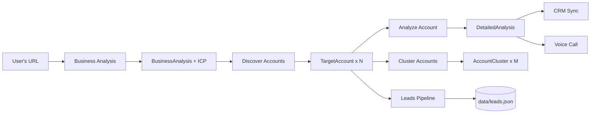

Scores drive UI ordering:

- **`fitScore`** — how well an account matches the ICP shape (0–100).
- **`timingScore`** — probability there's a *right now* buying event (0–100).
- **`priorityIndex`** — synthetic combination used to sort the pipeline (see `src/utils/calibration.ts`).
- **`freshnessScore`** — signal recency decay (FRESH / AGING / STALE).

---

## 3. User Roles

**Inference:** There is no server-side authentication, no user table, and no login flow in the codebase. The application is single-tenant, single-user, running under an implicit "owner" role. All state that would otherwise be per-user is scoped to a single browser (`localStorage`) or the single JSON DB (`data/leads.json`).

| Role | Present in code? | Access | Restrictions |
|---|---|---|---|
| **Owner (implicit)** | Yes — the only role | Every screen, every API | None enforced |
| **Admin** | No | — | — |
| **Guest / Anonymous** | No auth wall to enforce this | Full app (identical to Owner) | — |
| **CRM system user** | No (server-to-server) | — | — |
| **Vapi webhook** | Partially — HMAC-verified caller | Only `/api/vapi/webhook` | Signature verification via `VAPI_WEBHOOK_SECRET` |

**Permissions matrix (as-implemented):**

| Action | Owner | Vapi webhook |
|---|---|---|
| Run business analysis | ✅ | ❌ |
| Push to CRM | ✅ | ❌ |
| Trigger voice call | ✅ | ❌ |
| Deliver call transcript events | ❌ | ✅ (webhook only) |
| Read scheduler status | ✅ | ❌ |

**Authentication flow:** None for user; HMAC signature validation for Vapi webhook (see §16 and `server.ts:4066` — `VAPI_WEBHOOK_SECRET`).

---

## 4. Complete User Flow

### 4.1 Master happy-path (first-time visitor → discovered accounts → CRM push)

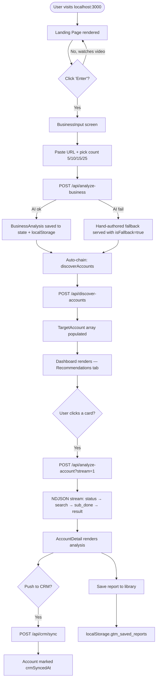

### 4.2 Alternative paths

- **Load an existing report** — click *Saved Reports* → pick → state is hydrated from `localStorage.gtm_saved_reports` (no API call).
- **Voice-drive the entire flow** — Jarvis orb click → speak "analyze stripe.com" → `analyzeUrl` action fires the pipeline (`src/App.tsx:673`).
- **CSV-driven ingest** — Leads tab imports rows, calls `/api/leads/bulk` (`server.ts:5235`).
- **Scheduled re-run** — cron fires `runPersonaDiscoveryJob()` (`server.ts:5573`) → sweeps enrolled accounts → new leads appear next visit.
- **Voice call** — from an account card, dial via Vapi (phone) or open the browser WebRTC modal.

### 4.3 Failure paths

| Failure | UI behavior | Backend behavior |
|---|---|---|
| No `ANTHROPIC_API_KEY` and no `OPENAI_API_KEY` | Toast: "OpenAI API quota exceeded or API Key is missing." Simulated data loads. | Endpoint's `catch` returns hand-authored fallback with `isFallback: true`, HTTP 200 |
| Anthropic 5xx / 529 overload | Silent retry with 1s → 2s → 4s backoff, up to 3 attempts × 2 models | `runAnthropic` in `server.ts` |
| Anthropic 401 / 403 / quota | Immediate short-circuit, drops to fallback | `server.ts` retry logic |
| Streaming aborted mid-flight | Progress cleared, `toast.error('Deep analysis failed: ...')` | Client-only, no server side effect |
| CRM push conflict (dedup match) | Modal shows diff, user picks update-or-skip | `src/utils/crmMirror.ts` `findMatch` + `diffAccount` |
| Vapi webhook signature invalid | 401, event dropped | `server.ts:4066` |
| localStorage quota exceeded | Silent try/catch — save is dropped | `src/App.tsx` all `useEffect` persistence blocks |

### 4.4 Validation paths

- Client-side URL validation is minimal — the `BusinessInput` component just checks non-empty (`src/components/BusinessInput.tsx`).
- Server clamps `accountCount` to [3, 30] (`server.ts:1676`).
- Jarvis input capped at 4000 chars for `/api/jarvis/chat`; context at 8000 (`server.ts:5856`).
- Leads DB dedup enforced via `linkedin_url` in `upsertLead()` (`src/db/leads.ts:230`).

### 4.5 Retry logic

- **AI calls:** 3 attempts × 2-model ladder (Opus → Haiku, or gpt-4o → gpt-4o-mini). 1s → 2s → 4s exponential backoff. Non-retryable on 401/403/429 (`server.ts` `runAnthropic` / `runOpenAI`).
- **CRM sync:** Atomic per-account with retry loop (`server.ts` `/api/crm/sync`).
- **Vapi call start:** Single-shot; failure surfaces error to user (`server.ts:4142`).

---

## 5. Complete Application Workflow

### 5.1 Request/response lifecycle (end-to-end)

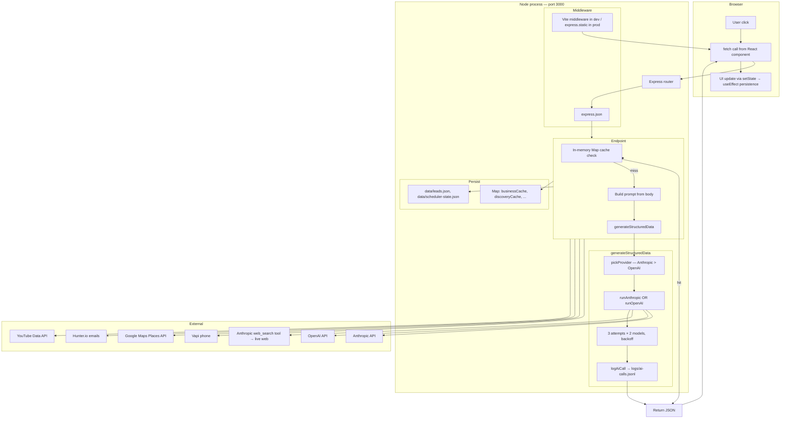

### 5.2 Cold-start sequence

1. `npm run dev` → `tsx server.ts`
2. `dotenv.config()` reads `.env` (`server.ts:13`)
3. `dbSeedIfEmpty()` populates `data/leads.json` with 6 AEC demo leads if empty (`server.ts:5317`, `src/db/leads.ts:429`)
4. `loadSchedulerState()` rehydrates last cron results (`server.ts:5439`)
5. `armScheduler()` — registers 3 cron jobs *only if* `ENABLE_SCHEDULER=true` (`server.ts:5631`)
6. Vite dev-middleware mounted (dev) OR `dist/` served static (prod) (`server.ts:5928`)
7. `app.listen(3000, "0.0.0.0")` (`server.ts:5943`)

---

## 6. Folder Structure Explanation

```
AI-Market-Pulse/
├── server.ts                      ← ENTIRE backend (5,948 lines) — Express + 30 endpoints + scheduler + Jarvis
├── src/
│   ├── main.tsx                   ← React entry, StrictMode + createRoot
│   ├── App.tsx                    ← Top-level state, per-screen theme, Jarvis action router
│   ├── index.css                  ← Tailwind v4 @import + custom @theme + shadcn CSS vars
│   ├── types.ts                   ← Every shared TS type (BusinessAnalysis, TargetAccount, DetailedAnalysis, CRM types, Voice types, Social types)
│   ├── components/
│   │   ├── LandingPage.tsx        ← Marketing page (2,155 lines) with hero + video + features + CTA
│   │   ├── BusinessInput.tsx      ← URL input screen + account count picker (5/10/15/25)
│   │   ├── Dashboard.tsx          ← Post-analysis workspace (5,478 lines) — 5 tabs, kanban, filters, CRM modal
│   │   ├── AccountDetail.tsx      ← One-account deep view (2,579 lines) — personas, competitors, stakeholders
│   │   ├── AccountCard.tsx        ← Wide + Compact card variants (767 lines)
│   │   ├── SavedReportsLibrary.tsx← List saved reports, load / delete / rename
│   │   ├── ThemeToggle.tsx        ← Global light/dark toggle
│   │   ├── JarvisOrb.tsx          ← Bottom-right orb, STT / TTS / command router (740 lines)
│   │   ├── LeadsTab.tsx           ← Leads pipeline UI, CSV import, refresh, scoping
│   │   ├── MapsPanel.tsx          ← Google Maps Places industry discovery
│   │   ├── SchedulerStatus.tsx    ← Cron job status + manual run trigger
│   │   ├── SocialSignalsCard.tsx  ← 10-platform social presence card
│   │   ├── VoiceCallModal.tsx     ← WebRTC voice call UI (1,176 lines)
│   │   ├── EmailPatternWidget.tsx ← Learn pattern + guess email (hidden as of 2026-07-29)
│   │   └── ui/                    ← shadcn/ui: button, card, dialog, tabs, badge, scroll-area, separator, skeleton
│   ├── utils/
│   │   ├── calibration.ts         ← Scoring, priority tiers, sector multipliers, pathway assessment
│   │   ├── crmMirror.ts           ← Client-side CRM record mirror (localStorage)
│   │   ├── emailPattern.ts        ← Pure email pattern detect + apply (9 patterns)
│   │   ├── geography.ts           ← ccTLD → country map, AI-country resolver
│   │   └── schedule.ts            ← Timezone-aware wall-clock → UTC conversion
│   ├── services/
│   │   └── proxycurl.ts           ← LinkedIn profile verification wrapper (real when key set, deterministic stub otherwise)
│   ├── db/
│   │   └── leads.ts               ← JSON-file leads store (dedup by linkedin_url)
│   └── lib/
│       └── utils.ts               ← cn() = clsx + tailwind-merge helper
├── scripts/                       ← Demo / capture / codebase-sweep helpers (mostly .mjs)
│   ├── build-deck.mjs             ← pptxgenjs pitch-deck builder
│   ├── build-narration.mjs        ← OpenAI TTS narration for the deck
│   ├── build-slideshow.mjs        ← Video slideshow from screenshots
│   ├── capture-screens.mjs        ← Playwright screenshot capture across app screens
│   ├── record-walkthrough.mjs     ← Playwright screen recording
│   ├── capture-landing.mjs        ← Landing-page-only capture
│   ├── recapture-landing.mjs      ← Idempotent re-capture
│   ├── stitch-landing.py          ← ffmpeg-style stitcher
│   ├── add-dark-variants.mjs      ← Idempotent regex sweep — adds dark: siblings to slate/color classes
│   ├── fix-dark-contrast.mjs      ← Fixes accidental dark-mode contrast reductions
│   ├── fix-opacity-collision.mjs  ← Repairs bg-X-50/N vs bg-X-950/N interactions
│   ├── bump-text-sizes.mjs        ← Bumps tiny arbitrary font sizes (text-[Npx]) to readable minimums
│   ├── bump-h-tag-weight.mjs      ← Heading weight upgrades
│   ├── reskin-linear.mjs          ← Linear.app-inspired theme sweep
│   └── soften-heading-weights.mjs ← Global heading weight softener
├── public/
│   ├── ai-market-pulse-ppt.pptx   ← Built pitch deck (8.7 MB)
│   ├── ai-market-pulse_product-demo.mp4 ← Product demo video (35 MB)
│   ├── intro-video.mp4            ← Original landing intro (20 MB)
│   ├── favicon.svg
│   └── vee-technologies-logo.png
├── data/                          ← Gitignored runtime data
│   ├── leads.json                 ← Leads DB (source of truth for §13 §14)
│   └── scheduler-state.json       ← Persisted cron job history
├── logs/                          ← Gitignored — ai-calls.jsonl for observability
├── outputs/                       ← Gitignored (271 MB of build artifacts) — deck / video / screenshots
├── evals/                         ← Not enumerated but referenced by npm scripts (`eval`, `inspect`)
├── docs/
│   ├── OVERVIEW.md
│   └── ENTERPRISE_DOCUMENTATION.md ← This document
├── .env                           ← Gitignored — provider keys, feature flags
├── vite.config.ts
├── tsconfig.json
├── package.json
├── CLAUDE.md                      ← Onboarding note for Claude Code
└── components.json                ← shadcn/ui config
```

### 6.1 Why each folder exists

| Folder | Purpose |
|---|---|
| **`server.ts` (root)** | Single-process pattern: chosen so hackathon devs run one command (`npm run dev`) and get frontend + backend on the same port. |
| **`src/components/ui/`** | Isolated shadcn/ui primitives with CSS-var theming. Isolated so upstream shadcn updates don't touch business components. |
| **`src/utils/`** | Pure logic — no React, no fetch — trivially unit-testable. All scoring, pattern learning, timezone math lives here. |
| **`src/services/`** | Adapters to external APIs (currently only proxycurl). Wraps SDKs to a stable seam. |
| **`src/db/`** | Data-access layer. Public API is DB-agnostic — swapping `leads.json` for Postgres means changing only this file. |
| **`scripts/`** | Two kinds: (1) demo asset builders (Playwright + pptxgenjs), (2) codebase sweepers (regex-anchored transforms for styling passes). |
| **`public/`** | Static assets served verbatim by Vite / Express — logos, videos, decks. |
| **`data/`** | Runtime state. Gitignored so the demo starts clean. |
| **`logs/`** | Observability sink for AI calls, aggregated by `evals/inspect.ts`. |
| **`evals/`** | *Not Found in Codebase* enumerated in this pass — referenced by `npm run eval` and `npm run inspect` in `package.json`. |

---

## 7. Module-by-Module Documentation

### 7.1 Business Analysis Module

| Aspect | Detail |
|---|---|
| **Purpose** | Turn a URL into a `BusinessAnalysis` (business name, overview, services, value prop, target industries, country, ICP). |
| **Business logic** | Fetches the page HTML (sub-page URLs get scoped analysis), strips chrome, feeds into AI with rich few-shot examples for fintech + dev-tools. AI-inferred country used downstream by Maps panel. |
| **Files** | `server.ts:1447-1668` (endpoint), `src/App.tsx:216-257` (`analyzeBusiness()`), `src/components/BusinessInput.tsx` (UI) |
| **API endpoint** | `POST /api/analyze-business` |
| **Frontend screen** | Analyze Website (`BusinessInput`) |
| **Dependencies** | Anthropic SDK, OpenAI SDK, `businessCache` Map |
| **Sequence** | Client fetch → cache check → optional page HTML fetch (sub-page) → prompt build with few-shot → `generateStructuredData` → cache write → JSON response |
| **Data flow** | User URL → `BusinessAnalysis` → persisted to `localStorage.gtm_analysis`, `localStorage.gtm_analyzed_url` |
| **Validation** | URL required (400 if missing); no format check |
| **Error handling** | Any throw → `getAnalyzeBusinessFallback(url)` returns hand-authored data with `isFallback: true`, HTTP 200 |
| **Security** | `safeFetch` in `server.ts` — SSRF hardening via DNS resolution + private-IP block-list |
| **Example response** | `{businessName: "Stripe", overview: "…", services: […], valueProp: "…", targetIndustries: […], country: "United States", icp: {title, description, targetRoles, buyingSignals}}` |

### 7.2 Account Discovery Module

| Aspect | Detail |
|---|---|
| **Purpose** | Given `BusinessAnalysis`, discover N real target companies with fit + timing scores. |
| **Files** | `server.ts:1671-1789`, `src/App.tsx:259-324` |
| **API** | `POST /api/discover-accounts` |
| **Business logic** | Clamps N to [3, 30]. Prompt asks for firmographic fields (employees, geography, industry, techStack, financialStatus). Web search enabled (Anthropic path). |
| **Side effect** | After success, App fires `/api/enrichment/sweep` and `/api/scheduler/enroll` to pre-warm leads pipeline. |
| **Cache** | `discoveryCache` keyed on `{businessName, icpTitle, count}` |
| **Response** | `TargetAccount[]` — each row gets `id: acc-{idx}-{timestamp}` and `status: 'new'` client-side |

### 7.3 Account Deep-Dive Module

| Aspect | Detail |
|---|---|
| **Purpose** | For one account, produce buyer personas + counter-narratives + competitors + multi-threading stakeholder map + outreach draft. |
| **Files** | `server.ts:1791-2334`, `src/App.tsx:326-431`, `src/components/AccountDetail.tsx` |
| **API** | `POST /api/analyze-account?stream=1` (NDJSON stream) |
| **Fan-out** | 3 parallel sub-calls: personas, competitors, stakeholders. Each streams progress events. |
| **Stream events** | `{type:'status'}`, `{type:'search'}`, `{type:'sub_done'}`, `{type:'result'}`, `{type:'error'}` |
| **Client** | Reads NDJSON line-by-line, updates `analysisProgress` for live "AI is thinking..." UI |

### 7.4 Cluster Segments Module

| Aspect | Detail |
|---|---|
| **Purpose** | Group discovered accounts into strategic segments sharing characteristics (sub-vertical, growth stage, tech stack, etc.). |
| **Files** | `server.ts:2336-2641`, cluster tab in `Dashboard.tsx` |
| **API** | `POST /api/cluster-accounts` |
| **Output** | `AccountCluster[]` — each cluster has name, characteristicType, sharedCharacteristics, accountIds, unifiedValueMessage, coordinatedOutreachAngle |

### 7.5 Leads Pipeline Module

| Aspect | Detail |
|---|---|
| **Purpose** | Persistent person-level pipeline. Dedup by LinkedIn URL. Auto-emails via learned company pattern. |
| **Files** | `src/db/leads.ts` (486 lines), `src/components/LeadsTab.tsx`, `src/services/proxycurl.ts`, `server.ts:5193-5313` |
| **API** | `GET /api/leads`, `GET /api/leads/:id`, `POST /api/leads`, `POST /api/leads/bulk`, `POST /api/leads/:id/refresh` |
| **DB** | `data/leads.json` — three arrays: `companies`, `leads`, `events` |
| **Statuses** | `fresh` / `role_changed` / `left_company` / `stale` / `unreachable` |
| **Sources** | `seed` / `auto` / `csv` / `manual` |
| **Dedup key** | `linkedin_url` (normalized) |

### 7.6 Email Pattern Module

| Aspect | Detail |
|---|---|
| **Purpose** | Detect a company's email convention from sample emails, then apply it to any name. |
| **Files** | `src/utils/emailPattern.ts`, `server.ts:5099-5191` |
| **API** | `POST /api/learn-email-pattern`, `GET /api/companies/:domain/email-pattern`, `POST /api/guess-email` |
| **Patterns** | 9 patterns: `first.last`, `firstlast`, `flast`, `first_last`, `lastf`, `first`, `last`, `first-last`, `firstl` |
| **Confidence** | verified (≥3 samples AND ≥60%) / probable (≥2) / guess (<2) / unknown (empty) |
| **UI status** | Widget was **hidden as of commit `f068374`** on 2026-07-29 — `AccountDetail.tsx:1687` wraps in `{false && …}`. Endpoint still callable. |

### 7.7 CRM Integration Module

| Aspect | Detail |
|---|---|
| **Purpose** | Push discovered accounts to a real CRM (ProspectAccel) with JWT auth. Falls back to a localStorage mirror for demo. |
| **Files** | `server.ts:3602-3888`, `src/utils/crmMirror.ts` (client mirror) |
| **API** | `POST /api/crm/connect`, `POST /api/crm/sync`, `POST /api/crm/disconnect`, `POST /api/crm/preview-request`, `GET /api/crm/status` |
| **Auth** | JWT via `jsonwebtoken`; SSRF hardening on the CRM host |
| **Dedup** | Client-side `findMatch({name, domain, email, linkedin})` in `crmMirror.ts` |

### 7.8 Google Maps Discovery Module

| Aspect | Detail |
|---|---|
| **Purpose** | Discover related companies near the seller's location, or in a chosen country. |
| **Files** | `server.ts:4838-5097`, `src/components/MapsPanel.tsx`, `src/utils/geography.ts` |
| **API** | `POST /api/maps/places` |
| **Env** | `GOOGLE_MAPS_API_KEY` (required for real results) |
| **Country detection** | AI-derived first, ccTLD fallback, free-text overview scan (`geography.ts:detectCountry`) |

### 7.9 Voice Call Module

| Aspect | Detail |
|---|---|
| **Purpose** | Two modes — WebRTC browser call (OpenAI Realtime API) OR Vapi outbound phone dial. |
| **Files** | `server.ts:4136-4835`, `src/components/VoiceCallModal.tsx`, `src/utils/schedule.ts` |
| **API** | `GET /api/voice-call/config`, `POST /api/voice-call/start`, `POST /api/voice-call/session`, `GET /api/voice-call/:callId`, `POST /api/vapi/webhook` (approx `server.ts:4308`) |
| **Scripts** | `discovery` / `follow_up` / `demo_booking` |
| **Rate limiting** | `VOICE_CALL_DAILY_QUOTA`, `VOICE_CALL_MAX_CONCURRENT`, `VOICE_CALL_SESSION_RATE_PER_IP` |
| **Client scheduler** | `ScheduledCall` in `types.ts:182` — client-side poller; browser must be open |

### 7.10 Social Signals Module

| Aspect | Detail |
|---|---|
| **Purpose** | For an account, harvest a 15-day rolling window of activity across 10 platforms. |
| **Files** | `server.ts:3278-3600`, `src/components/SocialSignalsCard.tsx` |
| **API** | `POST /api/analyze-social` |
| **Platforms** | linkedin, instagram, x, facebook, youtube, reddit, web, company_website, news, jobs (see `SocialPlatformId` in `types.ts:310`) |
| **External integrations** | YouTube Data API (via `YOUTUBE_API_KEY`), RapidAPI for X (via `RAPIDAPI_KEY`) |

### 7.11 Scheduler Module

| Aspect | Detail |
|---|---|
| **Purpose** | 3 cron jobs that keep lead/pattern data fresh without user action. |
| **Files** | `server.ts:5324-5674` |
| **Jobs** | `lead-health` (daily 02:00), `email-pattern-refresh` (Sunday 03:00), `persona-discovery` (daily 04:00) |
| **Enable** | `ENABLE_SCHEDULER=true` (default off). `/api/scheduler/run/:jobId` always works for manual runs. |
| **State** | Persisted to `data/scheduler-state.json` |
| **UI** | `src/components/SchedulerStatus.tsx` |

### 7.12 Jarvis Voice Assistant Module

| Aspect | Detail |
|---|---|
| **Purpose** | In-browser voice agent that answers questions and executes app actions. |
| **Files** | `server.ts:5677-5924`, `src/components/JarvisOrb.tsx`, `src/App.tsx:596-761` (action router) |
| **APIs** | `POST /api/jarvis/chat` (Claude Haiku 4.5 or gpt-4o-mini), `POST /api/jarvis/tts` (OpenAI TTS — gpt-4o-mini-tts → tts-1 → tts-1-hd fallback) |
| **STT** | Browser Web Speech API (free, client-only) |
| **Actions** | 28 registered actions (`JARVIS_ACTIONS` at `server.ts:5689`) — navigation, scroll, theme, dashboard control, saved reports control, landing video control |
| **Default state** | Click-to-talk (hands-free wake word opt-in via ear icon) — changed 2026-07-29 |

### 7.13 Persistence / Reports Module

| Aspect | Detail |
|---|---|
| **Purpose** | Save/load `{analysis, accounts}` snapshots as named reports. |
| **Files** | `src/App.tsx:144-214`, `src/components/SavedReportsLibrary.tsx` |
| **Storage** | `localStorage.gtm_saved_reports` (`SavedReport[]`) |
| **Auto-save** | Debounced re-save when accounts array changes and `activeReportId` is set (300ms debounce) |

---

## 8. Feature Documentation

Each feature ships end-to-end (backend endpoint + frontend surface + persistence + fallback). This section documents the most user-visible ones with configuration + edge cases.

### 8.1 URL → Business Analysis

- **Purpose:** Instant ICP from a URL.
- **How:** `POST /api/analyze-business` → optional page-content fetch (sub-page URLs) → AI (Haiku 4.5 primary) → JSON.
- **Files:** `server.ts:1447`, `src/components/BusinessInput.tsx`, `src/App.tsx:216`
- **Validation:** URL non-empty; server does not validate format.
- **Edge cases:** Sub-page URLs get scoped prompt (`isSubpage` block at `server.ts:1530`).
- **Fallback:** `getAnalyzeBusinessFallback(url)` returns AEC-tuned or SaaS-tuned data based on URL substring.
- **Config:** None end-user; provider auto-picked via env keys.

### 8.2 Account Discovery

- **Purpose:** N real companies matching the ICP.
- **How:** `POST /api/discover-accounts` with `{businessContext, icp, accountCount}`.
- **Validation:** `accountCount` clamped [3, 30]; default 10.
- **Edge cases:** After success, App fires `enrichment/sweep` (Hunter) + `scheduler/enroll` (cron queue).
- **Limitations:** Duplicates possible across runs — no cross-analysis dedup.

### 8.3 Streaming Deep Account Analysis

- **Purpose:** Live "AI is thinking..." UX during 3 parallel deep-dive sub-calls.
- **How:** NDJSON stream on `/api/analyze-account?stream=1`. Client parses newline-separated JSON events.
- **Files:** `server.ts:1791`, `src/App.tsx:326`
- **Edge cases:** If body not readable (some proxies), falls back to single JSON response.

### 8.4 CRM Sync

- **Purpose:** Push discovered accounts into ProspectAccel (or a local mirror).
- **How:** `POST /api/crm/connect` → JWT stored in memory → `/api/crm/sync` upserts.
- **Dedup:** `findMatch({name, domain, email, linkedin})` in `crmMirror.ts:119`.
- **Config:** ProspectAccel credentials from env (Not Found in Codebase — exact env names).

### 8.5 Voice Call (Vapi phone / WebRTC browser)

- **Purpose:** AI cold-calls a lead using a chosen script.
- **How (phone):** POST call intent to `/api/voice-call/start` with `mode: 'phone'` and E.164 number → Vapi dials.
- **How (browser):** `POST /api/voice-call/session` mints an OpenAI Realtime API ephemeral token; the browser's WebRTC talks directly to OpenAI.
- **Config:** `VAPI_API_KEY`, `VAPI_PHONE_NUMBER_ID`, `VAPI_WEBHOOK_SECRET`, `APP_URL`; `OPENAI_API_KEY` for realtime.
- **Rate limits:** `VOICE_CALL_DAILY_QUOTA`, `VOICE_CALL_MAX_CONCURRENT`, `VOICE_CALL_SESSION_RATE_PER_IP`.

### 8.6 Scheduled Re-runs

- **Purpose:** Keep the leads DB current without user clicks.
- **How:** `node-cron` schedules 3 jobs when `ENABLE_SCHEDULER=true`. Manual triggers via `/api/scheduler/run/:jobId`.
- **State:** Persisted to `data/scheduler-state.json`; last 8 runs kept in history.

### 8.7 Jarvis Voice Assistant

- **Purpose:** Voice-drive the entire app.
- **How:** Browser SpeechRecognition captures phrase → POST to `/api/jarvis/chat` → LLM returns `{reply, action, args}` → App dispatches action (see `src/App.tsx:627`).
- **Default:** Click-to-talk (was always-on wake word until commit `599d8a0`, reverted 2026-07-29 in `f068374`).
- **Actions:** 28 registered — see `JARVIS_ACTIONS` at `server.ts:5689`.

### 8.8 Google Maps Industry Discovery

- **Purpose:** Discover related companies near the seller.
- **How:** MapsPanel resolves seller country → `POST /api/maps/places` → Places Text Search → dedup vs self-domain.
- **Config:** `GOOGLE_MAPS_API_KEY`.

### 8.9 Social Signals

- **Purpose:** 15-day rolling activity on 10 platforms per account.
- **How:** `POST /api/analyze-social` merges AI-inferred profile guesses with real YouTube + X pulls.
- **Config:** `YOUTUBE_API_KEY`, `RAPIDAPI_KEY`.

### 8.10 PDF Export

- **Purpose:** Export a single account's deep analysis as PDF.
- **How:** `html2canvas` → `jsPDF` in `AccountDetail.tsx`.
- **Limitations:** Layout can shift on wide dashboards; page break not always clean (Inference).

### 8.11 Saved Reports

- **Purpose:** Bookmark a `{analysis, accounts}` snapshot.
- **How:** `localStorage.gtm_saved_reports` array; auto-save with 300ms debounce.
- **Limit:** Browser localStorage cap (~5-10MB). Not Found in Codebase — no explicit cap warning.

### 8.12 Landing Page + Product Intro Video

- **Purpose:** Marketing hero + embedded product tour video for demos.
- **How:** `LandingPage.tsx` renders; `public/intro-video.mp4` is the source.

---

## 9. Screen / Page Documentation

### 9.1 Landing Page

| Field | Value |
|---|---|
| **Route** | `/` when `showLanding && !analysis && activeLandingTab !== 'saved-library'` |
| **Component** | `LandingPage` (`src/components/LandingPage.tsx`) |
| **Purpose** | Marketing site; first thing every visitor sees. |
| **APIs called** | None on mount. Play-video / scroll actions dispatched by Jarvis. |
| **Buttons/actions** | Enter workspace, Watch video, See Features, Get Started |
| **Theme** | Forced dark |

### 9.2 Analyze Website (BusinessInput)

| Field | Value |
|---|---|
| **Route** | Rendered when `!analysis && activeLandingTab === 'analyze'` |
| **Component** | `BusinessInput` (`src/components/BusinessInput.tsx`) |
| **Purpose** | Single URL input + account count (5/10/15/25). |
| **Backend** | `POST /api/analyze-business` (auto-chains `discover-accounts`) |
| **Validation** | Non-empty URL |
| **Theme** | Dark |

### 9.3 Dashboard

| Field | Value |
|---|---|
| **Route** | Rendered when `analysis && activeLandingTab === 'analyze'` |
| **Component** | `Dashboard` (`src/components/Dashboard.tsx` — 5,478 lines) |
| **Purpose** | Post-analysis workspace with 5 tabs. |
| **Tabs** | Recommendations, Target Segments (Clusters), Partner Pathways, GTM Pipeline, Leads |
| **APIs** | `/api/discover-accounts` (refresh), `/api/cluster-accounts`, `/api/analyze-account`, `/api/enrichment/sweep`, `/api/crm/*`, `/api/leads/*`, `/api/analyze-social`, `/api/maps/places` |
| **Business logic** | Priority-wave filtering, ICP exclusion engine, channel partner scoring, save/load, CSV import |
| **Theme** | Light |

### 9.4 Account Detail

| Field | Value |
|---|---|
| **Purpose** | Deep view of one target: personas + competitors + stakeholders + citations. |
| **Component** | `AccountDetail` (`src/components/AccountDetail.tsx` — 2,579 lines) |
| **APIs** | `/api/analyze-account?stream=1`, `/api/enrich-stakeholder`, `/api/crm/sync`, `/api/analyze-social`, `/api/voice-call/*` |
| **Buttons** | Push to CRM, Place AI voice call, Export PDF, Sync social signals |

### 9.5 Saved Reports Library

| Field | Value |
|---|---|
| **Purpose** | List of saved snapshots — load, rename, delete. |
| **Component** | `SavedReportsLibrary` (`src/components/SavedReportsLibrary.tsx`) |
| **Data source** | `localStorage.gtm_saved_reports` |
| **Theme** | Light body + dark header (scoped wrapper — see `App.tsx:458`) |

### 9.6 Voice Call Modal

| Field | Value |
|---|---|
| **Purpose** | Live in-browser AI voice call to a lead. |
| **Component** | `VoiceCallModal` (`src/components/VoiceCallModal.tsx` — 1,176 lines) |
| **APIs** | `/api/voice-call/config`, `/api/voice-call/session`, `/api/voice-call/:callId` |
| **Underlying** | OpenAI Realtime API via WebRTC ephemeral token |

### 9.7 Jarvis Orb (persistent overlay)

| Field | Value |
|---|---|
| **Purpose** | Bottom-right voice assistant, present on every screen. |
| **Component** | `JarvisOrb` (`src/components/JarvisOrb.tsx`) |
| **APIs** | `/api/jarvis/chat`, `/api/jarvis/tts` |

---

## 10. Navigation Flow

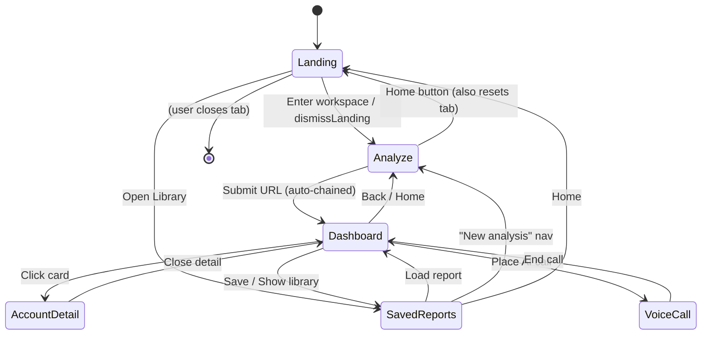

**Menu structure (implicit — no traditional nav sidebar):**

- **Global header (visible when `!analysis`):** Logo (→ Analyze tab), Home button, Analyze Website tab, Saved Reports tab, Theme toggle.
- **Global overlay:** Jarvis orb (bottom-right, all screens).
- **Dashboard tabs:** Recommendations · Target Segments · Partner Pathways · GTM Pipeline · Leads.
- **Conditional navigation:** Landing hides all headers; Saved Reports header is dark even when body is light.

---

## 11. Backend Architecture

### 11.1 Layered view

```mermaid
flowchart TB
  subgraph Layer1[Transport]
    Express[Express router]
  end
  subgraph Layer2[Cross-cutting]
    Sanitize[sanitizeString - log neutralizer]
    SSRF[safeFetch - DNS + IP allowlist]
    JWT[JWT verify - CRM]
    HMAC[HMAC verify - Vapi]
  end
  subgraph Layer3[Business]
    Endpoints["30 endpoints per §14"]
    Scheduler[armScheduler / runSchedulerJob]
    Jarvis[jarvisReplyAnthropic / jarvisReplyOpenAI]
  end
  subgraph Layer4[AI abstraction]
    GSD[generateStructuredData]
    Anth[runAnthropic]
    OA[runOpenAI]
    Log[logAiCall]
  end
  subgraph Layer5[Persistence]
    Mem[In-memory Maps]
    Files["data/leads.json, data/scheduler-state.json"]
    LogFile["logs/ai-calls.jsonl"]
  end
  subgraph Layer6[External SDK]
    AnthSDK[@anthropic-ai/sdk]
    OASDK[openai]
    Cron[node-cron]
    JWTLib[jsonwebtoken]
  end
  Layer1 --> Layer2 --> Layer3 --> Layer4 --> Layer6
  Layer4 --> Layer5
  Layer3 --> Layer5
```

### 11.2 Concept mapping to conventional MVC

| Convention | This codebase |
|---|---|
| Controller | Endpoint handlers inline in `server.ts` |
| Service | `generateStructuredData`, `runAnthropic`, `runOpenAI`, `runEnrichmentSweep`, `runLeadHealthJob`, `runEmailPatternRefreshJob`, `runPersonaDiscoveryJob` |
| Repository | `src/db/leads.ts` (leads), Maps for AI caches, `data/scheduler-state.json` for cron history |
| Model | TypeScript interfaces in `src/types.ts` |
| Middleware | `express.json()`, Vite dev middleware, HMAC verifier for Vapi |
| Jobs | node-cron scheduler in `server.ts:5324+` |
| Queues | Not implemented (sweeps are synchronous per-request) |
| Events / Listeners | Client-side only — `window.dispatchEvent('jarvis:landing'/'jarvis:dashboard'/…)` |
| Commands | `npm run dev`, `npm run build`, `npm run eval`, `npm run inspect` |
| Helpers | `src/utils/*.ts` |
| DI / Service Container | None — modules are direct imports |
| Lifecycle | `startServer()` at `server.ts:5928` — arm scheduler → mount Vite/static → listen |

### 11.3 `generateStructuredData` — the AI abstraction

Single funnel every endpoint uses (`server.ts:186-196`). Behavior:

1. `pickProvider()` — Anthropic if key present, else OpenAI, else throw.
2. **Anthropic path** (`runAnthropic`):
   - Uses `messages.create()` with `tool_use` (single `submit_result` tool) for guaranteed valid JSON.
   - Optional native web search via `web_search_20250305` tool.
   - System prompt cached with `cache_control: ephemeral` (5-min TTL).
   - Optional `progressSink` intercepts stream events for NDJSON forwarding.
3. **OpenAI path** (`runOpenAI`):
   - `chat.completions.create()` with `response_format: {type: 'json_schema'}`.
   - Web search degrades to no-op with log warning.
4. **Retry:** 3 attempts × 2-model ladder, exponential backoff 1s → 2s → 4s. 401/403/quota short-circuit.
5. **Array unwrap:** Anthropic tools require object schema — arrays get wrapped `{items: [...]}` and unwrapped after.
6. **Log:** Every attempt writes a JSONL line to `logs/ai-calls.jsonl` (see §25).

---

## 12. Frontend Architecture

### 12.1 High-level

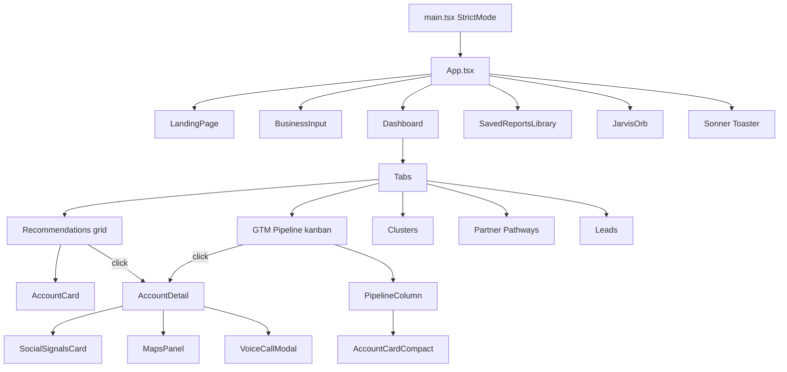

### 12.2 State model

- **Global state:** All owned by `App.tsx`; passed down as props (no Redux, no Zustand, no Context beyond what shadcn primitives use internally).
- **Persistence:** Every top-level slice mirrors to `localStorage` via `useEffect`.
- **Fetching:** Native `fetch()` — no React Query / SWR.
- **Routing:** No router library — screen selection is derived from state (`showLanding`, `analysis`, `activeLandingTab`).

### 12.3 Reusable primitives

| Component | Location | Purpose |
|---|---|---|
| `Button`, `Card`, `Dialog`, `Tabs`, `Badge`, `ScrollArea`, `Separator`, `Skeleton` | `src/components/ui/` | shadcn/ui, CSS-var themed |
| `AccountCard` (wide + `compact`) | `src/components/AccountCard.tsx` | Two layouts sharing the same theme helpers |
| `IntelCitation` | Inline inside `AccountDetail.tsx` | Cited claim rendering with confidence tiering |

### 12.4 Styling

- **Tailwind v4 (oxide)** — `@import "tailwindcss"` in `src/index.css`. No `tailwind.config.*` — inline `@theme` blocks.
- **shadcn CSS vars** — `--background`, `--foreground`, `--card`, etc. in `:root` / `.dark`.
- **Dark mode** — class-based (`.dark` on `<html>`). `ThemeToggle.tsx` observes DOM class changes via `MutationObserver`.
- **Custom variant** — `@custom-variant dark (&:is(.dark *))` at `src/index.css:48` enables *scoped* dark mode via wrapper `.dark` divs (used in Saved Reports header).

### 12.5 Forms & validation

- `react-hook-form` + `zod` + `@hookform/resolvers` are installed but only the inputs on `BusinessInput` and Leads CSV import use `react-hook-form`. Most inputs are controlled `useState`. Zod usage is minimal (mostly types, not runtime schemas).

### 12.6 UI libraries

| Library | Role |
|---|---|
| `sonner` | Toasts (top-right, richColors) |
| `motion` / `framer-motion` | Card hover animations, layout transitions |
| `gsap` | Landing page hero animations |
| `lucide-react` + `react-icons` | Iconography |
| `recharts` | Charts (dashboard stats) |
| `jspdf` + `html2canvas` | PDF export |

---

## 13. Database Documentation

### 13.1 Type

- **Store:** JSON file at `data/leads.json`, in-process cache in a `let cache: StoreShape | null` (`src/db/leads.ts:112`).
- **Rationale:** Chosen over SQLite for hackathon speed (avoids native compilation on Windows). Public API mirrors what a SQL store would expose — swap-in Postgres = change this file only.
- **Not suitable for 100k+ rows** — whole file re-serialized on every write.

### 13.2 Schema (three collections)

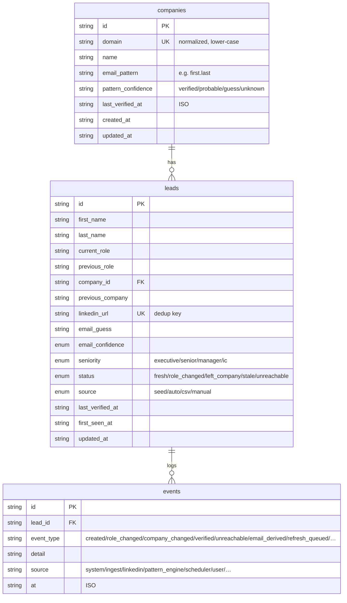

### 13.3 Indexes / constraints

- **No formal indexes** (JSON file). Look-ups are `Array.find`.
- **Unique constraint (soft):** `companies.domain`, `leads.linkedin_url` enforced by `upsertCompany` / `upsertLead` (`src/db/leads.ts:136, 226`).
- **Foreign keys (soft):** `leads.company_id → companies.id`, `events.lead_id → leads.id`.

### 13.4 Additional persisted state

| File | Owner | Contents |
|---|---|---|
| `data/leads.json` | `src/db/leads.ts` | Companies, leads, events |
| `data/scheduler-state.json` | `server.ts:5454` | Last result + last 8 history entries per cron job |
| `logs/ai-calls.jsonl` | `server.ts:149` | One JSON line per AI attempt (append-only) |

### 13.5 Triggers / views / stored procedures

- None — JSON store.
- **Derived views:** `listLeads()` sorts by `STATUS_SORT` map (`src/db/leads.ts:350`).

---

## 14. Complete API Documentation

**Base URL:** `http://localhost:3000` (dev + prod). All routes are POST unless noted; all bodies are JSON.

### 14.1 Full endpoint index

| Method | URL | Purpose | Auth | File |
|---|---|---|---|---|
| POST | `/api/analyze-business` | Analyze a URL → `BusinessAnalysis` | None | `server.ts:1447` |
| POST | `/api/discover-accounts` | Discover N target accounts | None | `server.ts:1671` |
| POST | `/api/analyze-account` | Deep account analysis (supports `?stream=1`) | None | `server.ts:1791` |
| POST | `/api/cluster-accounts` | Group accounts into segments | None | `server.ts:2336` |
| POST | `/api/enrich-stakeholder` | Enrich one stakeholder | None | `server.ts:2643` |
| POST | `/api/enrichment/sweep` | Batch enrich via Hunter | None | `server.ts:2723` |
| POST | `/api/scheduler/enroll` | Enroll accounts in persona-discovery queue | None | `server.ts:2768` |
| GET | `/api/scheduler/enrollment` | List enrolled accounts | None | `server.ts:2791` |
| POST | `/api/analyze-social` | Social signals for a company | None | `server.ts:3278` |
| POST | `/api/crm/connect` | JWT-connect to ProspectAccel | None (unauth here → tokens issued) | `server.ts:3602` |
| POST | `/api/crm/sync` | Upsert accounts into CRM | Bearer JWT | `server.ts:3680` |
| POST | `/api/crm/disconnect` | Clear CRM session | None | `server.ts:3817` |
| POST | `/api/crm/preview-request` | Dry-run CRM payload | None | `server.ts:3828` |
| GET | `/api/crm/status` | CRM connection state | None | `server.ts:3868` |
| GET | `/api/voice-call/config` | Config for the voice UI | None | `server.ts:4136` |
| POST | `/api/voice-call/start` | Kick a Vapi phone call OR queue browser | Rate-limited | `server.ts:4142` |
| POST | (~`server.ts:4308`) | Vapi webhook — call events | HMAC signature | `server.ts:4308` |
| POST | `/api/voice-call/session` | Mint OpenAI Realtime ephemeral token | Rate-limited per IP | `server.ts:4390` |
| GET | `/api/voice-call/:callId` | Poll call status | None | `server.ts:4537` |
| POST | `/api/maps/places` | Google Places text search | None | `server.ts:4838` |
| POST | `/api/learn-email-pattern` | Learn/refresh a company's email pattern | None | `server.ts:5099` |
| GET | `/api/companies/:domain/email-pattern` | Get cached pattern | None | `server.ts:5131` |
| POST | `/api/guess-email` | Guess an email from name + domain | None | `server.ts:5148` |
| GET | `/api/leads` | List leads (paginated + filterable) | None | `server.ts:5193` |
| GET | `/api/leads/:id` | Get one lead + last 20 events | None | `server.ts:5210` |
| POST | `/api/leads` | Upsert one lead | None | `server.ts:5220` |
| POST | `/api/leads/bulk` | CSV bulk upsert | None | `server.ts:5235` |
| POST | `/api/leads/:id/refresh` | Re-verify against LinkedIn | None | `server.ts:5252` |
| GET | `/api/scheduler/status` | Cron job dashboard data | None | `server.ts:5646` |
| POST | `/api/scheduler/run/:jobId` | Manually trigger a cron job | None | `server.ts:5665` |
| POST | `/api/jarvis/chat` | Jarvis LLM turn | None | `server.ts:5855` |
| POST | `/api/jarvis/tts` | OpenAI TTS → mp3 | None | `server.ts:5884` |

### 14.2 Endpoint detail (example — analyze-business)

**Method / URL:** `POST /api/analyze-business`

**Purpose:** Read a company URL and infer its business shape + ICP.

**Auth:** None.

**Request body:**

```json
{ "url": "https://stripe.com" }
```

**Response (success, 200):**

```json
{
  "businessName": "Stripe",
  "overview": "Stripe provides payment processing infrastructure...",
  "services": ["Payments", "Billing", "Connect", "Radar"],
  "valueProp": "Programmable payments API for internet businesses",
  "targetIndustries": ["SaaS", "Marketplaces", "Platforms"],
  "country": "United States",
  "icp": {
    "title": "Head of Payments at Series B-D SaaS with $10M+ ARR",
    "description": "Growth-stage SaaS companies...",
    "targetRoles": ["Head of Payments", "CTO", "VP Engineering"],
    "buyingSignals": ["New CFO announced within 6 months", "..."]
  }
}
```

**Response (fallback, 200):** Same shape with `isFallback: true`.

**Validation:** URL required (`400` if missing).

**Business logic:**

1. `cacheKey = url.trim().toLowerCase()` → in-memory `businessCache` map lookup.
2. If URL is a sub-page, fetch the HTML, strip chrome, append to prompt with `PAGE-SCOPED ANALYSIS` override block.
3. Prompt includes 2 few-shot examples (fintech, dev-tools) for shape/depth.
4. `generateStructuredData` → Haiku 4.5 primary, Opus 4.7 fallback.
5. Cache write, return JSON.

**Error handling:** Any throw → `getAnalyzeBusinessFallback(url)` → 200 with `isFallback`.

**Rate limits:** None enforced.

**Internal vs external:** Internal — never invoked directly by third parties.

---

**All other endpoints** follow the same pattern: JSON body → optional cache → `generateStructuredData` (or SDK call) → JSON out. Fallbacks return HTTP 200 with `isFallback: true`.

---

## 15. External APIs

| Integration | Purpose | Files | Env var | Free / Paid | SDK | Fallback |
|---|---|---|---|---|---|---|
| **Anthropic Claude** | Primary AI provider — structured outputs, web search | `server.ts` `runAnthropic` | `ANTHROPIC_API_KEY` | Paid (per-token) | `@anthropic-ai/sdk` v0.110 | OpenAI, then hand-authored data |
| **OpenAI** | Fallback AI provider; TTS; Realtime API for voice | `server.ts` `runOpenAI`, `/api/jarvis/tts`, `/api/voice-call/session` | `OPENAI_API_KEY` | Paid | `openai` v6.45 | Hand-authored data (chat), 503 (TTS) |
| **Anthropic web_search tool** | Live web grounding for AI calls | Inside `runAnthropic`, `useWebSearch: true` | Requires `ANTHROPIC_API_KEY` | Paid (Claude-side) | Server-side tool, no external HTTP | No-op when OpenAI provider active |
| **Vapi** | Outbound phone dialing | `server.ts:4142` `/api/voice-call/start`, webhook `:4308` | `VAPI_API_KEY`, `VAPI_PHONE_NUMBER_ID`, `VAPI_WEBHOOK_SECRET`, `VAPI_WEBHOOK_URL` | Paid | Raw fetch | Config error to user |
| **Google Maps Places API** | Industry discovery | `server.ts:4838` | `GOOGLE_MAPS_API_KEY` | Paid (per-request tier) | Raw fetch | Empty result set + toast |
| **Hunter.io** | Company email samples | Inside `runEnrichmentSweep` (`server.ts`) | `HUNTER_API_KEY` (`server.ts:2467`) | Freemium | Raw fetch | Deterministic stub (`stubHunterDomainSearch`) |
| **Proxycurl** | LinkedIn profile verification | `src/services/proxycurl.ts` | *Inference:* `PROXYCURL_API_KEY` (referenced in `server.ts:5307`) | Paid | Raw fetch | Deterministic stub reusing prior DB fields |
| **YouTube Data API** | Real YouTube data for Social Signals | `server.ts:3110` | `YOUTUBE_API_KEY` | Free tier / paid | Raw fetch | AI-inferred only |
| **RapidAPI (X / Twitter)** | Real X data | `server.ts:3205` | `RAPIDAPI_KEY` | Paid | Raw fetch | AI-inferred only |
| **ProspectAccel CRM** | Real CRM push | `server.ts` `/api/crm/*` | Not Found in Codebase (in this pass) | Paid | Raw fetch + JWT | localStorage mirror (`src/utils/crmMirror.ts`) |

**Retry strategy** (all AI): exponential backoff 1 → 2 → 4 s, 3 attempts × 2-model ladder, non-retryable on 401/403/429.

**Error handling pattern:** All external calls wrapped in try/catch → log via `sanitizeString` → return fallback data or graceful error. Never throw to the client.

---

## 16. Authentication & Authorization

### 16.1 End-user auth

**None.** There is no login, no session, no cookie, no user table.

### 16.2 CRM (server → ProspectAccel)

- `POST /api/crm/connect` accepts credentials → mints/receives a JWT (uses `jsonwebtoken`).
- Subsequent `/api/crm/sync` calls carry the JWT in the Authorization header (server-side, not exposed to browser).
- Storage: in-process (Not Found in Codebase — persistence to disk).

### 16.3 Vapi webhook

- Route: `~server.ts:4308` `POST` handler with HMAC signature check.
- Config: `VAPI_WEBHOOK_SECRET`. If unset AND `VAPI_WEBHOOK_ALLOW_UNSIGNED=true`, unsigned requests accepted (demo mode).
- Verifies signature → passes payload to the call session store.

### 16.4 Rate limiting

- `VOICE_CALL_DAILY_QUOTA` — max calls per day (global).
- `VOICE_CALL_MAX_CONCURRENT` — max concurrent Vapi calls.
- `VOICE_CALL_SESSION_RATE_PER_IP` — per-IP rate for `/api/voice-call/session`.

### 16.5 SSRF hardening

`safeFetch` (referenced by page-content fetch and CRM push) resolves the target hostname's IP and blocks private/loopback ranges before fetching. Prevents attackers from asking the server to fetch `http://169.254.169.254/…`.

### 16.6 Token / secrets management

- All secrets read from `.env` via `dotenv` at process start.
- No secrets logged (`sanitizeString` rewrites `error`/`fail`/`exception` in logs but does NOT redact keys — Inference: relies on secrets not being interpolated into log lines, which is followed by convention).

### 16.7 Password / session flows

None.

---

## 17. Environment Configuration

Complete list of every `process.env.*` referenced in the codebase.

| Variable | Purpose | Required | Default | Sensitive | Impact if missing |
|---|---|---|---|---|---|
| `ANTHROPIC_API_KEY` | Primary AI provider | One of Anthropic/OpenAI required | — | Yes | Falls back to OpenAI, then to hand-authored data |
| `OPENAI_API_KEY` | Fallback AI + TTS + Realtime voice | One of Anthropic/OpenAI required | — | Yes | TTS + browser voice calls disabled; AI falls back to hand-authored data |
| `HUNTER_API_KEY` | Real email discovery | Optional | — | Yes | Stub Hunter returns deterministic mock samples |
| `PROXYCURL_API_KEY` | Real LinkedIn verification | Optional | — | Yes | Stub Proxycurl returns "reachable" with existing DB values |
| `YOUTUBE_API_KEY` | Real YouTube signals | Optional | — | Yes | AI-inferred only for the YouTube platform |
| `RAPIDAPI_KEY` | Real X / Twitter signals | Optional | — | Yes | AI-inferred only for X |
| `GOOGLE_MAPS_API_KEY` | Real Places search | Optional | — | Yes | Maps panel returns empty + error toast |
| `VAPI_API_KEY` | Vapi outbound calls | Required only for `mode: 'phone'` | — | Yes | Phone call mode disabled; browser mode still works |
| `VAPI_PHONE_NUMBER_ID` | Vapi caller ID | Required for phone mode | — | No | Same as above |
| `VAPI_WEBHOOK_URL` | Vapi callback URL | Required for phone mode | — | No | Vapi can't deliver events |
| `VAPI_WEBHOOK_SECRET` | HMAC signing key | Required unless `ALLOW_UNSIGNED` | — | Yes | Webhook rejects requests |
| `VAPI_WEBHOOK_ALLOW_UNSIGNED` | Skip HMAC for demo | Optional | `false` | No | Allows unsigned webhooks |
| `APP_URL` | Public base for CORS + Vapi callback | Optional | `http://localhost:3000` | No | Extra origins won't be allowed |
| `VOICE_CALL_EXTRA_ORIGINS` | Additional allowed origins | Optional | — | No | Only `APP_URL` allowed |
| `VOICE_CALL_DAILY_QUOTA` | Global voice call cap | Optional | Inference: hardcoded default | No | Unlimited daily (Inference) |
| `VOICE_CALL_MAX_CONCURRENT` | Concurrent call cap | Optional | Inference | No | Unlimited concurrent (Inference) |
| `VOICE_CALL_SESSION_RATE_PER_IP` | Ephemeral token rate limit | Optional | Inference | No | Unrestricted (Inference) |
| `DEMO_DEFAULT_PHONE` | Default dial-out number for demos | Optional | — | Yes | User must type each number |
| `ENABLE_SCHEDULER` | Arm the 3 cron jobs | Optional | `false` | No | Cron disabled; manual `/api/scheduler/run/:jobId` still works |
| `LEAD_HEALTH_CRON` | Override lead-health cron | Optional | `0 2 * * *` | No | Daily at 02:00 |
| `LEAD_HEALTH_LABEL` | Human label for lead-health cron | Optional | "Daily at 02:00" | No | Uses cron expr as label |
| `PATTERN_REFRESH_CRON` | Email-pattern-refresh cron | Optional | `0 3 * * 0` | No | Sundays at 03:00 |
| `PATTERN_REFRESH_LABEL` | Label | Optional | "Sundays at 03:00" | No | — |
| `PERSONA_DISCOVERY_CRON` | Persona-discovery cron | Optional | `0 4 * * *` | No | Daily at 04:00 |
| `PERSONA_DISCOVERY_LABEL` | Label | Optional | "Daily at 04:00" | No | — |
| `NODE_ENV` | `production` triggers `dist/` serving | Optional | — | No | Vite dev middleware used |
| `DISABLE_HMR` | Turn off Vite HMR + file watch | Optional | `false` | No | HMR active (used by hosted AI Studio) |

*Not Found in Codebase:* explicit ProspectAccel credential env variable names in this pass — inspecting `server.ts:3602-3680` would confirm them.

---

## 18. Configuration Files

| File | Purpose |
|---|---|
| **`.env`** | Runtime secrets + feature flags. Gitignored (`!.env.example` allowed). |
| **`.env.example`** | *Not Found in Codebase* in the file tree — should be added for onboarding clarity. |
| **`package.json`** | npm scripts (`dev`, `build`, `start`, `lint`, `eval`, `inspect`), deps (React 19, Vite 6, Express, Anthropic/OpenAI SDKs, node-cron, sonner, etc.). |
| **`tsconfig.json`** | TS 5.8, ES2022 target, `moduleResolution: bundler`, path alias `@/*` → `./src/*`, `noEmit` (Vite emits). |
| **`vite.config.ts`** | React + Tailwind v4 plugins, `@` alias, HMR toggle via `DISABLE_HMR`. |
| **`components.json`** | shadcn/ui — Base UI (`@base-ui/react`), CSS variables theming. |
| **`.gitignore`** | Excludes `node_modules/`, `dist/`, `.env*`, `logs/`, `data/`, `*.db`, `outputs/`. |
| **`CLAUDE.md`** | Onboarding note for Claude Code — architecture summary, fallback strategy, style conventions. |
| **`docs/OVERVIEW.md`** | Existing brief overview (pre-dating this file). |

No webpack, no Docker, no nginx, no Apache, no ESLint config, no Prettier config in this pass.

---

## 19. Tech Stack Documentation

| Layer | Tech | Version |
|---|---|---|
| **Frontend framework** | React | 19.0.1 |
| **Build tool** | Vite | 6.2.3 |
| **Language** | TypeScript | 5.8 |
| **CSS** | Tailwind v4 (oxide) | 4.1.14 |
| **UI kit** | shadcn/ui on Base UI | `@base-ui/react` 1.4 |
| **State** | React `useState` + `useEffect` + `localStorage` | built-in |
| **Forms** | `react-hook-form` + `zod` + `@hookform/resolvers` | 7.75 / 4.4 |
| **Toasts** | `sonner` | 2.0 |
| **Animations** | `motion` / `framer-motion` + `gsap` | 12.x / 3.15 |
| **Icons** | `lucide-react` + `react-icons` | 0.546 / 5.7 |
| **Charts** | `recharts` | 3.8 |
| **PDF / capture** | `jspdf` + `html2canvas` + `html2canvas-pro` | 4.2 / 1.4 |
| **Backend framework** | Express | 4.21 |
| **Runtime loader (dev)** | `tsx` | 4.21 |
| **Bundler (prod backend)** | `esbuild` | 0.25 |
| **AI SDKs** | Anthropic + OpenAI | 0.110 / 6.45 |
| **Cron** | `node-cron` + `cron-parser` | 4.6 / 5.6 |
| **JWT** | `jsonwebtoken` | 9.0 |
| **Storage** | JSON files + browser `localStorage` | — |
| **Cache** | In-process `Map`s | — |
| **Logging** | Console + JSONL append (`logs/ai-calls.jsonl`) | — |
| **Monitoring** | `evals/inspect.ts` (Not Found in Codebase content) | — |
| **CI/CD** | *Not Found in Codebase* (no `.github/workflows` in this pass) | — |
| **Testing** | *None — CLAUDE.md explicitly notes "There is no test suite."* | — |
| **Demo tooling** | Playwright + pptxgenjs (devDeps) | 1.62 / 4.0 |
| **Env loader** | `dotenv` | 17.2 |
| **External phone** | Vapi | HTTP + webhook |
| **Deployment** | *Inference:* Single Node process, no Docker in this pass. | — |

---

## 20. Request Lifecycle

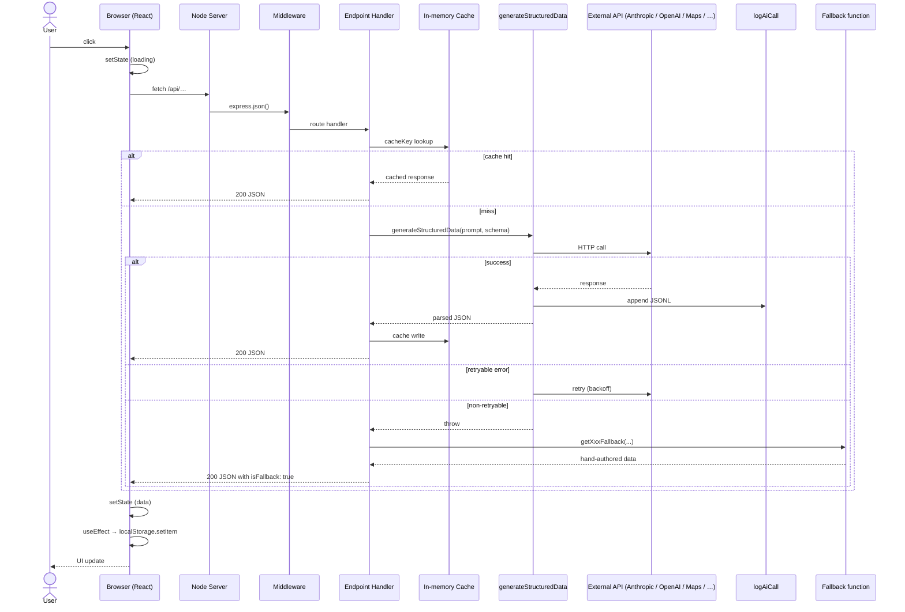

---

## 21. Complete Data Flow

### 21.1 Where data originates

| Data | Origin |
|---|---|
| `BusinessAnalysis` | AI response to `/api/analyze-business` |
| `TargetAccount[]` | AI response to `/api/discover-accounts` |
| `DetailedAnalysis` | AI response to `/api/analyze-account` (streamed) |
| `AccountCluster[]` | AI response to `/api/cluster-accounts` |
| `LeadRow` | User (manual), CSV import, cron persona-discovery, Hunter enrichment |
| `CRMRecord` | ProspectAccel push OR local mirror |
| `SocialActivity` | AI + YouTube + RapidAPI |
| `SavedReport` | User "Save" action, or debounced auto-save |
| `VoiceCallState` | Vapi webhook OR OpenAI Realtime session |
| Cron history | `runSchedulerJob` results |

### 21.2 Validation

- **Client:** Non-empty checks only (URL, first/last name, etc.)
- **Server:** Body-level presence checks (`if (!url) return 400`), numeric clamps (`accountCount` [3, 30]), string-length caps (`message.slice(0, 4000)`).
- **AI:** Structured output enforced via tool-use JSON schema (Anthropic) or `response_format: json_schema` (OpenAI).

### 21.3 Movement

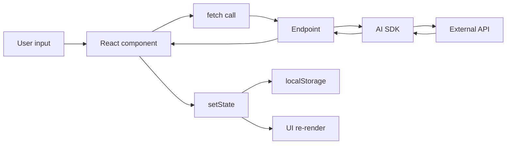

### 21.4 Storage locations

| Where | What |
|---|---|
| `localStorage.gtm_analysis` | Current `BusinessAnalysis` |
| `localStorage.gtm_accounts` | `TargetAccount[]` with lazy `DetailedAnalysis` |
| `localStorage.gtm_saved_reports` | `SavedReport[]` |
| `localStorage.gtm_active_report_id` | Currently-loaded report id |
| `localStorage.gtm_analyzed_url` | Last URL analyzed (for Maps geo detection) |
| `localStorage.gtm_channel_partners` | Partner pathway config |
| `localStorage.gtm_theme` | Light/dark preference |
| `localStorage.gtm_crm_mirror_v1` | Mock CRM records |
| `data/leads.json` | Server-side leads DB |
| `data/scheduler-state.json` | Cron state |
| `logs/ai-calls.jsonl` | AI call observability |
| Server in-process Maps | `businessCache`, `discoveryCache`, `accountAnalysisCache`, `enrichmentCache`, `socialCache` |

### 21.5 Caching

- **AI response caching:** Per-endpoint `Map` keyed by request inputs. Lifetime = server process. No eviction, no TTL. Reset on process restart.
- **Prompt caching (provider-side):** Anthropic system prompt marked `cache_control: ephemeral` — 5-minute TTL, dramatic cost reduction on hot sessions.
- **Client rehydration:** `useState` initializers read `localStorage` on mount.

### 21.6 Background jobs

- 3 cron jobs (see §7.11).
- Fire-and-forget client-triggered sweeps: `enrichment/sweep` + `scheduler/enroll` after discovery.

### 21.7 Error paths

See §23.

---

## 22. Sequence Diagrams

### 22.1 URL → Discovered Accounts (streaming)

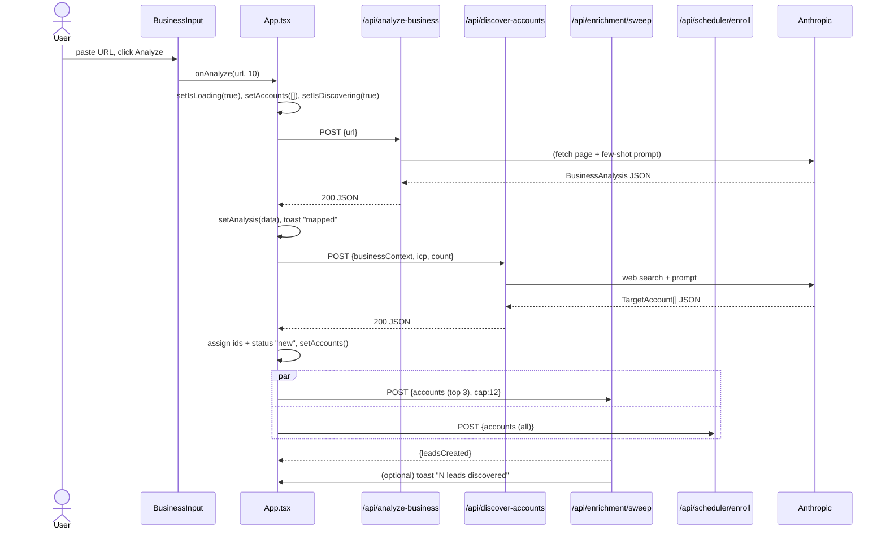

### 22.2 Deep account analysis (streaming)

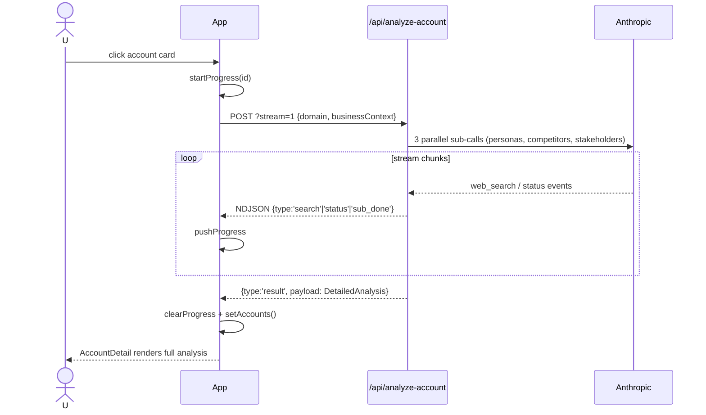

### 22.3 CRM Sync

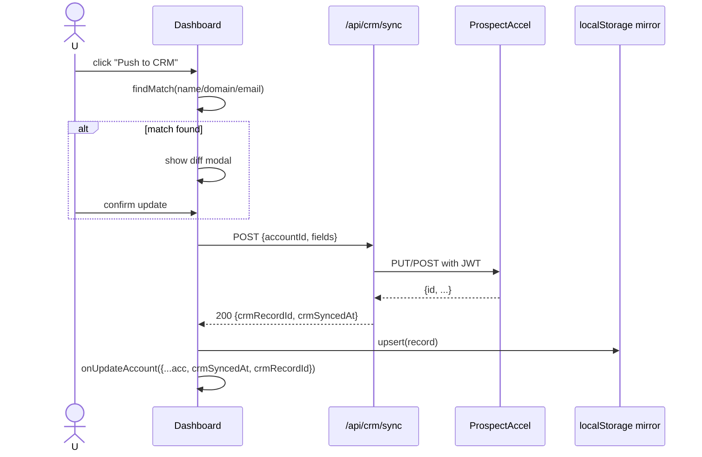

### 22.4 Voice call (browser WebRTC)

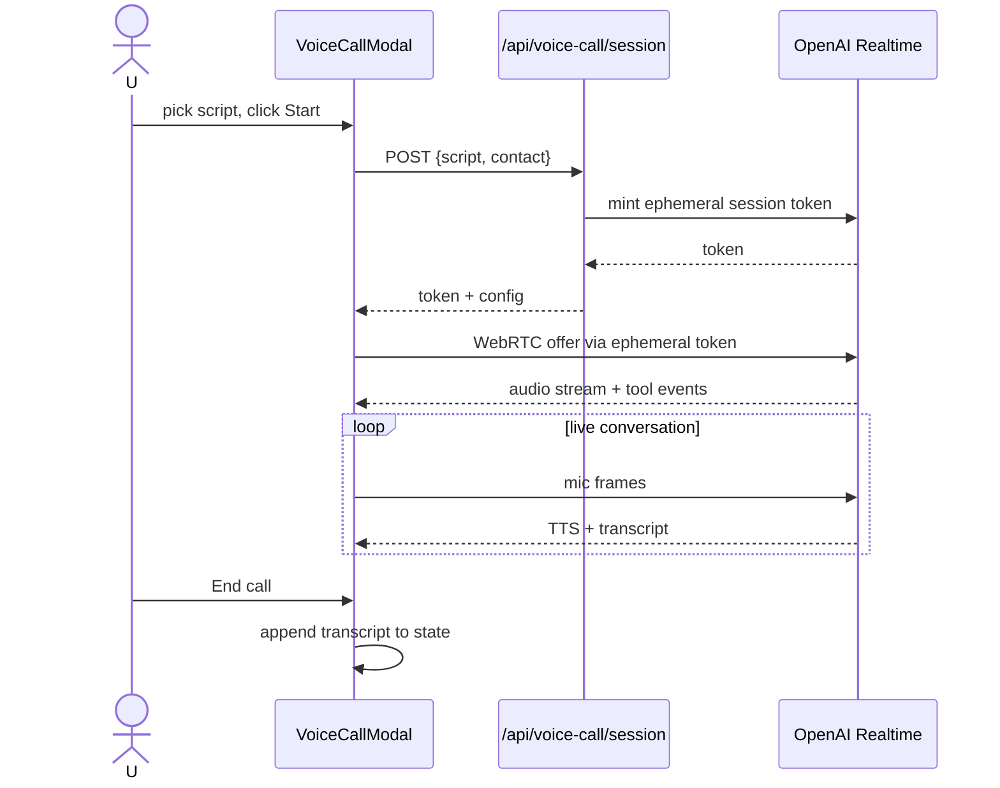

### 22.5 Jarvis command

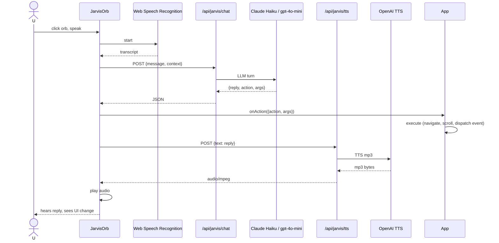

### 22.6 Cron job execution

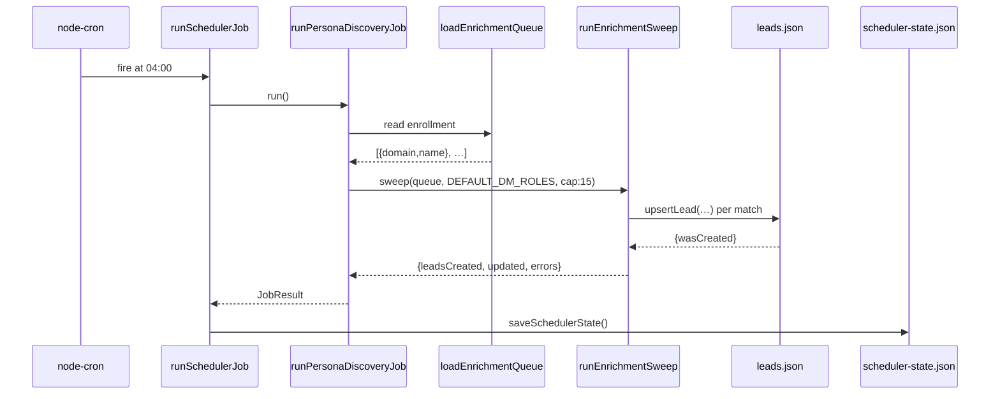

---

## 23. Error Handling

| Layer | Behavior |
|---|---|
| **Validation errors** | Server returns `400 {error: '…'}`. Client shows `toast.error`. |
| **AI provider errors** | Retried per §11.3. Terminal failures → per-endpoint fallback returning HTTP 200 + `isFallback: true`. |
| **Streaming errors** | Emitted as `{type: 'error', message}` on the NDJSON stream. Client throws and clears progress. |
| **CRM push conflict** | Diff modal blocks the sync until user picks update / skip / create-new. |
| **Vapi webhook signature invalid** | 401 dropped. |
| **localStorage quota** | Silent try/catch; save dropped without user notice. |
| **Fetch abort / network** | `catch (e)` shows toast; component enters idle state. |
| **UI runtime errors** | *Not Found in Codebase*: no ErrorBoundary. Errors bubble to browser console. |
| **Log sanitization** | `sanitizeString` rewrites `error`/`fail`/`exception` in log strings to avoid triggering CI/CD alert rules (Inference: mostly a hackathon quirk). |

**Retry logic:** exponential backoff (1s → 2s → 4s), 3 attempts, 2-model ladder. See `server.ts` `runAnthropic` / `runOpenAI`.

**User messages:** All via Sonner (`toast.error`, `toast.warning`, `toast.success`, `toast.info`) at top-right.

---

## 24. Security

| Concern | Status |
|---|---|
| **Authentication (user)** | None. Single-tenant desktop-style app. |
| **Authorization** | None. |
| **Encryption at rest** | None — JSON files on disk. |
| **Encryption in transit** | Depends on deployment. Localhost = HTTP. Production HTTPS is deployment concern (Not Found in Codebase — no HTTPS server code). |
| **Secrets** | `.env` — gitignored. No secrets in code. |
| **HTTPS enforcement** | None enforced in code. |
| **CORS** | *Not Found in Codebase* explicit CORS middleware. `APP_URL` + `VOICE_CALL_EXTRA_ORIGINS` referenced but usage inspection needed. |
| **CSRF** | No cookies → not applicable in current form. |
| **XSS** | React auto-escapes. No `dangerouslySetInnerHTML` in this pass. |
| **SQL Injection** | Not applicable — no SQL. JSON store uses in-memory filtering. |
| **Prototype pollution** | Not audited. JSON parses without merge or `Object.assign` from user input in scanned code. |
| **Input validation** | Presence checks + length caps only. |
| **Rate limiting** | Only on voice call session tokens (per-IP + daily quota + concurrency cap). Other endpoints have no rate limits. |
| **SSRF** | Guarded via `safeFetch` (DNS resolve + private-IP block). |
| **JWT** | Used server-to-server for CRM (`jsonwebtoken`). Never sent to browser. |
| **HMAC** | Vapi webhook signature verification. |
| **Log sanitization** | Yes — but a defensive measure for alerting, not a secret redactor. |
| **Dependency scanning** | *Not Found in Codebase* — no Dependabot / Snyk config detected. |

**Production hardening TODOs (Inference):**

1. Add HTTPS termination (nginx / cloud LB).
2. Add per-endpoint rate limits (currently only voice call).
3. Add CSP headers.
4. Add ErrorBoundary in React.
5. Sanitize AI-generated content that lands in tooltips / titles (react auto-escapes, so this is defense-in-depth).

---

## 25. Logging & Monitoring

### 25.1 Logs

- **Console:** All endpoint handlers log via `console.log`. `sanitizeString` scrubs "error/fail/exception" for CI-friendliness.
- **AI calls JSONL:** `logs/ai-calls.jsonl` — one line per attempt. Fields: `ts, endpoint, subCall, model, attempt, status, durationMs, inputTokens, outputTokens, cacheReadTokens, cacheCreationTokens, webSearchCount, webSearchEnabled, errorClass, errorSnippet`.
- **Aggregator:** `npm run inspect` → `tsx evals/inspect.ts` (implementation not read in this pass).

### 25.2 Error tracking

- No Sentry / Rollbar / Datadog integration in code.

### 25.3 Analytics

- No user analytics (PostHog, Amplitude, GA) in code.

### 25.4 Monitoring

- No health check endpoint defined in this pass. `GET /` returns the SPA HTML which returns 200 — effectively a liveness probe.

### 25.5 Audit trails

- Server-side: `events` table in leads DB tracks lead lifecycle changes.
- Server-side: `scheduler-state.json` history for cron.
- Client-side: `CRMActivity[]` inside each `CRMRecord`.

---

## 26. Performance

| Optimization | Where |
|---|---|
| **In-process AI cache** | 5 `Map`s in `server.ts:21-25` — dedupes repeated identical calls in the same process lifetime. |
| **Anthropic prompt caching** | System prompt marked `cache_control: ephemeral` (5-min TTL). Big cost reduction for hot sessions. |
| **Model tiering** | Simpler endpoints (business analysis) default to Haiku 4.5 (10x cheaper than Opus, comparable quality). |
| **Streaming** | `/api/analyze-account?stream=1` returns first byte in <1s (status event) instead of waiting for the whole 30s+ payload. |
| **Fire-and-forget** | Post-discovery, `enrichment/sweep` + `scheduler/enroll` run in parallel without blocking the discovery response. |
| **Debounced auto-save** | Report auto-save is 300ms debounced (`App.tsx:135`). |
| **Lazy analysis** | Per-account deep dive fires only on card click. |
| **Compact card variant** | Kanban view uses vertical dense layout for 300px columns. |
| **Landing video preload** | Not applied — `intro-video.mp4` is 20 MB; loaded on demand. |
| **HMR toggle** | `DISABLE_HMR=true` skips file watching for hosted environments. |
| **JSON file DB** | Fast at hackathon scale. Whole-file rewrite on every commit — a bottleneck beyond ~10k rows. |
| **No CDN** | Static assets served by Express directly. |
| **No compression middleware** | *Not Found in Codebase* — no `compression` middleware registered. |

---

## 27. Deployment

### 27.1 Build

```bash
npm run build
```

- `vite build` → SPA to `dist/`.
- `esbuild server.ts --bundle --platform=node --format=cjs --packages=external --sourcemap --outfile=dist/server.cjs`.
- Output is a single CommonJS bundle that requires `node_modules` at runtime (`--packages=external`).

### 27.2 Run production

```bash
NODE_ENV=production node dist/server.cjs
```

- `NODE_ENV=production` triggers `express.static(dist)` instead of Vite dev middleware (`server.ts:5929`).
- Port hardcoded to 3000. Change requires code edit.

### 27.3 Docker / CI/CD

*Not Found in Codebase.* No Dockerfile, no `.github/workflows/`, no `.gitlab-ci.yml`.

### 27.4 Environment setup

1. `cp .env.example .env` (file not present — create manually)
2. Set at minimum one of `ANTHROPIC_API_KEY` / `OPENAI_API_KEY`.
3. Optional integrations per §17.

### 27.5 Server requirements

- Node 20+ (evidenced by `Node.js v20.19.0` in restart output).
- ~200MB memory for the process; AI cache Maps grow with usage.
- Write access to `data/`, `logs/`, `dist/`.
- Outbound HTTPS to Anthropic, OpenAI, Vapi, Maps, YouTube, Hunter, Proxycurl, RapidAPI, ProspectAccel.

---

## 28. Third Party Libraries

| Package | Purpose | Where | Possible alt |
|---|---|---|---|
| `@anthropic-ai/sdk` | Claude API | `server.ts` | LangChain, Vercel AI SDK |
| `openai` | OpenAI API | `server.ts`, `/api/jarvis/tts`, `/api/voice-call/session` | LangChain, Vercel AI SDK |
| `express` | HTTP server | `server.ts` | Fastify, Hono |
| `vite` + `@vitejs/plugin-react` | Dev + build | `vite.config.ts`, `server.ts` | Next.js, Remix |
| `@tailwindcss/vite` | Tailwind v4 build | `vite.config.ts` | PostCSS + tailwind CLI |
| `sonner` | Toasts | `App.tsx` | react-hot-toast |
| `framer-motion` / `motion` | Animations | many components | react-spring |
| `gsap` | Landing hero animations | `LandingPage.tsx` | anime.js |
| `lucide-react` | Icons | many | heroicons |
| `react-icons` | Additional icons | some | — |
| `recharts` | Charts | Dashboard | victory, chart.js |
| `jspdf` + `html2canvas` | PDF export | `AccountDetail.tsx` | react-pdf |
| `node-cron` + `cron-parser` | Scheduler | `server.ts` | agenda, bull |
| `jsonwebtoken` | JWT signing | `server.ts` CRM | jose |
| `dotenv` | .env loading | `server.ts` | native `--env-file` (Node 20+) |
| `zod` + `react-hook-form` + `@hookform/resolvers` | Forms | limited | Formik + yup |
| `class-variance-authority` + `clsx` + `tailwind-merge` | Class composition | `src/lib/utils.ts` `cn()` | — |
| `@base-ui/react` | shadcn base | `src/components/ui/` | Radix UI |
| `playwright` | Screen capture + walkthrough | `scripts/*.mjs` | puppeteer |
| `pptxgenjs` | Deck builder | `scripts/build-deck.mjs` | officegen |
| `tsx` | TS runtime for dev | `npm run dev` | ts-node |
| `esbuild` | Prod backend bundle | `npm run build` | tsup, rollup |
| `@fontsource-variable/geist` | Geist font | `src/index.css` (Inference) | direct CDN |

---

## 29. AI Components

### 29.1 Provider abstraction

Every AI call goes through `generateStructuredData(prompt, schema, options)` (`server.ts:186`). Auto-picks Anthropic if `ANTHROPIC_API_KEY` is set, else OpenAI.

### 29.2 Models used

| Endpoint | Anthropic primary | Anthropic fallback | OpenAI primary | OpenAI fallback |
|---|---|---|---|---|
| `/api/analyze-business` | Haiku 4.5 | Opus 4.7 | gpt-4o-mini | gpt-4o |
| `/api/discover-accounts` | Opus 4.7 | Haiku 4.5 | gpt-4o | gpt-4o-mini |
| `/api/analyze-account` (each sub-call) | Opus 4.7 | Haiku 4.5 | gpt-4o | gpt-4o-mini |
| `/api/cluster-accounts` | Opus 4.7 | Haiku 4.5 | gpt-4o | gpt-4o-mini |
| `/api/analyze-social` | Haiku 4.5 | Opus 4.7 | gpt-4o-mini | gpt-4o |
| `/api/enrich-stakeholder` | Haiku 4.5 | Opus 4.7 | gpt-4o-mini | gpt-4o |
| `/api/jarvis/chat` | Haiku 4.5 (fixed) | — | gpt-4o-mini (fixed) | — |
| `/api/jarvis/tts` | — | — | `gpt-4o-mini-tts` → `tts-1` → `tts-1-hd` | — |
| `/api/voice-call/session` | — | — | Realtime API | — |

### 29.3 Prompt flow

- **System prompt:** Static B2B GTM analyst persona, cached ephemeral. See `SYSTEM_PROMPT_TEXT` at `server.ts:86`.
- **User prompt:** Endpoint-specific with rich few-shot examples and enum discipline.
- **Tool-use:** `submit_result` tool guarantees valid JSON.
- **Web search:** Anthropic native tool (`web_search_20250305`), 5 uses max default.

### 29.4 Embeddings / RAG / Vector DB

None. No embeddings, no vector DB, no RAG. Grounding is done via live web search per-call.

### 29.5 Streaming

- `/api/analyze-account?stream=1` uses Anthropic streaming with `progressSink` callback forwarding search + status events as NDJSON.
- Client parses line-by-line (`App.tsx:379`).

### 29.6 Token handling / cost control

- `max_tokens: 8192` default (per call).
- Model tiering per endpoint (cheap default, expensive fallback).
- Prompt caching on system prompt.
- Every call logged with input/output/cache token counts.

### 29.7 Conversation memory

- **None persistent** across `/api/jarvis/chat` calls. Each turn is one-shot; the browser passes `context` string that describes current app state (analyzed URL, business, accounts, saved reports, current screen — see `App.tsx:597`).

### 29.8 Agents / tools

- Jarvis is an "agent" in the loose sense — one tool call (`respond`) that returns `{reply, action, args}`. No multi-step agent loop.

---

## 30. Code Execution Flow (Feature Trace)

**Feature traced:** User pastes `https://stripe.com`, sees 10 discovered accounts, clicks Stripe → sees deep analysis.

### Step 1 — user clicks Analyze

- `src/components/BusinessInput.tsx` → `onAnalyze(url, 10)` handler
- Calls `App.analyzeBusiness('https://stripe.com', 10)` (`src/App.tsx:216`)

### Step 2 — App fires request

- `setAccounts([])`, `setActiveReportId(null)`, `setAnalyzedUrl('https://stripe.com')`, `setIsDiscovering(true)` (`App.tsx:221-226`)
- `fetch('/api/analyze-business', {method: 'POST', body: JSON.stringify({url})})` (`App.tsx:228`)

### Step 3 — Server receives request

- Express router hits `app.post('/api/analyze-business')` at `server.ts:1447`
- `businessCache.has('https://stripe.com')` → false on first hit
- URL parsed → not a sub-page → skip page-fetch
- Prompt built with 2 few-shot examples (`server.ts:1548-1628`)
- Schema declared (`server.ts:1630-1650`)

### Step 4 — AI call

- `generateStructuredData(prompt, schema, {endpoint: '/api/analyze-business', models: {anthropic: [Haiku, Opus], openai: [mini, 4o]}})`
- `pickProvider()` → `'anthropic'` (assuming key set)
- `runAnthropic(prompt, schema, options)` (`server.ts:202`)
- `messages.create({model: 'claude-haiku-4-5-20251001', tools: [{name: 'submit_result', input_schema: schema}], tool_choice: {type: 'tool', name: 'submit_result'}, system: [ephemeral], messages: […]})`
- Anthropic returns `tool_use` block with structured `BusinessAnalysis`
- `logAiCall({endpoint, model, status: 'ok', durationMs, inputTokens, outputTokens, …})` → appends to `logs/ai-calls.jsonl`

### Step 5 — Response back to client

- `businessCache.set('https://stripe.com', data)` (`server.ts:1661`)
- `res.json(data)` → 200 JSON to browser

### Step 6 — App processes response

- `App.analyzeBusiness` → `setAnalysis(data)` → `toast.success('Business logic mapped')` (`App.tsx:237-245`)
- `useEffect` at `App.tsx:80` → `localStorage.setItem('gtm_analysis', ...)`
- **Auto-chain:** `discoverAccounts(data, 10)` called immediately (`App.tsx:248`)

### Step 7 — Discovery request

- `fetch('/api/discover-accounts', {body: {businessContext, icp, accountCount: 10}})`
- Server (`server.ts:1671`) clamps count → 10, builds cache key, misses → calls `generateStructuredData` with Opus primary + web_search enabled
- Anthropic model runs 5 web searches, returns `TargetAccount[]`
- `discoveryCache.set(cacheKey, data)`
- `res.json(data)` → 200

### Step 8 — Client updates accounts

- `App.discoverAccounts` → `formattedAccounts = data.map((acc, idx) => ({...acc, id: 'acc-{idx}-{ts}', status: 'new'}))` (`App.tsx:275`)
- `setAccounts(formattedAccounts)` → `useEffect` writes to `localStorage.gtm_accounts`
- Fire-and-forget `enrichment/sweep` + `scheduler/enroll` (`App.tsx:301-317`)

### Step 9 — Dashboard mounts

- App switches from `BusinessInput` render branch to `Dashboard` render branch (`App.tsx:554`)
- `Dashboard` reads `accounts`, renders Recommendations tab grid of `AccountCard` (wide variant)

### Step 10 — User clicks Stripe card

- `Dashboard` → `onAnalyzeAccount(id)` → `App.analyzeAccountDetail(id)` (`App.tsx:326`)
- If account has no `analysis`, `startProgress(id)` → renders "AI is thinking…" banner
- `fetch('/api/analyze-account?stream=1', {body: {domain, businessContext: analysis}})`

### Step 11 — Streaming deep dive

- Server (`server.ts:1791`) fans out 3 parallel sub-calls (personas, competitors, stakeholders) via `generateStructuredData` with `progressSink`
- Each sub-call streams events → sink forwards `{type:'search',query}` events to the response NDJSON
- Final `{type:'result',payload:DetailedAnalysis}` closes the stream

### Step 12 — Client parses stream

- `App.analyzeAccountDetail` reads NDJSON via `ReadableStream` reader (`App.tsx:379-413`)
- On each event, `pushProgress({message | search})` → banner updates
- On `result` → `setAccounts(prev => prev.map(a => a.id === id ? {...a, analysis: payload} : a))`
- `AccountDetail` re-renders with full analysis

### Step 13 — UI updated

- `AccountDetail.tsx` shows buyer personas, competitor cards, stakeholder map with citations
- User can now push to CRM, place voice call, export PDF

**Total files touched in this one user flow:**
`src/components/BusinessInput.tsx`, `src/App.tsx`, `server.ts`, `src/db/leads.ts` (via sweep), `src/utils/emailPattern.ts` (via sweep), `src/components/Dashboard.tsx`, `src/components/AccountCard.tsx`, `src/components/AccountDetail.tsx`.

---

## 31. Business Rules

Hidden logic scattered across scoring, pathway assessment, and cron thresholds. Enumerated here for future maintainers.

| Rule | Where | Detail |
|---|---|---|
| Account count clamp | `server.ts:1676` | `Math.max(3, Math.min(30, count))` |
| ICP exclusion engine | `src/components/Dashboard.tsx` | Sets `isDisqualified` + `disqualificationReasons` when firmographic hard-nos are hit |
| Priority tiering | `src/utils/calibration.ts` | `immediate` / `nurture` / `standard` / `reresearch` / `disqualified` — colors and behaviors flow from this |
| Freshness decay | `calibration.ts` | Signal age > threshold → `AGING` → `STALE` |
| Sector multiplier | `calibration.ts` | Some sectors weight fit/timing differently (SaaS / Manufacturing / Fintech / Biotech / AEC / General) |
| Pathway approach | `calibration.ts` | `Direct` / `Channel Partner` / `Integration Partner` / `Mutual Connection` |
| Lead status transitions | `src/db/leads.ts:282-330` | `role_changed` on role change, `left_company` on company change, `fresh` on unchanged verify |
| Email pattern confidence | `src/utils/emailPattern.ts:153` | verified ≥3 samples & ≥60%; probable ≥2; else guess |
| Cron freshness thresholds | `server.ts:5379-5383` | LEAD_HEALTH_STALE_DAYS=30, PATTERN_STALE_DAYS=14 |
| Cron caps per run | `server.ts:5380-5383` | LEAD_HEALTH_CAP=20, PATTERN_CAP=10, PERSONA_DISCOVERY_CAP=15 |
| Sweep after discovery | `App.tsx:297-317` | Only top 3 accounts sweep for immediate emails (cap 12), all accounts enrolled for cron |
| Report auto-save debounce | `App.tsx:135-142` | 300ms after account state settles |
| Country resolution priority | `src/utils/geography.ts:185` | AI-derived → ccTLD → text scan |
| Voice call rate limits | `server.ts:3951-4005` | Daily quota + concurrent cap + per-IP session rate |
| Jarvis reply length | `server.ts:5750` (JARVIS_SYSTEM) | 1-3 sentences default, up to 5-6 for explanations |
| Jarvis action registry | `server.ts:5689-5726` | 28 actions max — new actions require both a JARVIS_ACTIONS entry and an `App.tsx:627` case |

---

## 32. Known Limitations

| Category | Item |
|---|---|
| **Hardcoded values** | `PORT = 3000` (server.ts:16); AI account count [3, 30] clamp; JSON DB path (`data/leads.json`); Jarvis reply length; freshness thresholds. |
| **Technical debt** | `Dashboard.tsx` is 5,478 lines (intentionally monolithic per CLAUDE.md, but hard to navigate); `LandingPage.tsx` at 2,155 lines; `AccountDetail.tsx` at 2,579 lines. |
| **Scalability** | JSON DB rewrites the whole file on every commit — collapses beyond ~10k leads. In-process AI caches never evict — memory grows with unique requests. No horizontal scaling (in-process state). |
| **Security** | No per-endpoint rate limiting except voice calls; no CORS enforcement in this pass; no auth; no ErrorBoundary; unaudited prototype pollution surface. |
| **Testability** | Zero test coverage. `npm run lint` is `tsc --noEmit` only. Utils files are pure so easy to add tests. |
| **UX bugs / rough edges** | Sub-page URL detection is best-effort; sub-page HTML fetch skipped silently on redirects; PDF export layout not tested at wide viewports; localStorage quota not surfaced. |
| **Ops** | No health-check endpoint; no metrics endpoint; no readiness probe; no graceful shutdown handler; no PID file. |
| **AI cost** | No per-user quota; a bot could hammer `/api/analyze-business` and burn provider credits. |
| **Compliance** | No PII redaction from prompts; user URLs and cached AI outputs sit in `logs/ai-calls.jsonl` indefinitely. |
| **Compatibility** | `SpeechRecognition` only in Chromium browsers. Jarvis STT silently unsupported on Safari/Firefox. |
| **Missing files** | `.env.example`, README updates, evals/ folder inspection, CI config. |
| **Windows-specific** | Chose JSON over SQLite to avoid native compilation. On Linux/Mac production, SQLite/Postgres is a clean upgrade path. |

---

## 33. Project Dependencies

### 33.1 Internal dependency graph (module level)

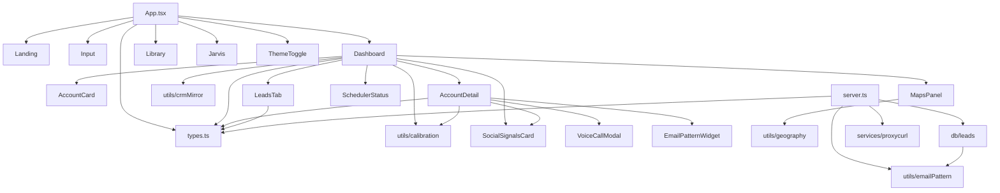

### 33.2 External dependency count

- **Prod deps:** 34 packages (`package.json` dependencies).
- **Dev deps:** 10 packages (`devDependencies`).

### 33.3 Circular dependencies

None identified in this pass — components depend on `types.ts` and `utils/*`, never the reverse.

---

## 34. How to Run the Project

### 34.1 Requirements

- **Node.js:** 20.19.0 or higher (evidenced at runtime).
- **npm:** 10+.
- **OS:** Windows / macOS / Linux.
- **Ports:** 3000 (server), 24678 (Vite HMR websocket).

### 34.2 Installation

```bash
git clone https://github.com/sashidziner-AI/AI-Market-Pulse.git
cd AI-Market-Pulse
npm install
```

### 34.3 Environment

Create `.env` in the repo root:

```dotenv
# At minimum one of:
ANTHROPIC_API_KEY=sk-ant-...
OPENAI_API_KEY=sk-...

# Optional integrations:
HUNTER_API_KEY=
PROXYCURL_API_KEY=
YOUTUBE_API_KEY=
RAPIDAPI_KEY=
GOOGLE_MAPS_API_KEY=
VAPI_API_KEY=
VAPI_PHONE_NUMBER_ID=
VAPI_WEBHOOK_URL=
VAPI_WEBHOOK_SECRET=

# Feature flags:
ENABLE_SCHEDULER=false
DISABLE_HMR=false
```

### 34.4 Run — development

```bash
npm run dev
```

Visits: <http://localhost:3000>

### 34.5 Run — production

```bash
npm run build
NODE_ENV=production node dist/server.cjs
```

### 34.6 Lint

```bash
npm run lint    # tsc --noEmit
```

### 34.7 Testing

No test suite.

### 34.8 Reset local state

```bash
rm data/leads.json data/scheduler-state.json
# In browser DevTools: Application → Storage → Clear site data
```

---

## 35. Testing

- **Unit tests:** None.
- **Integration tests:** None.
- **E2E tests:** None (Playwright is present but used only for screen capture / video walkthrough — see `scripts/capture-screens.mjs`, `scripts/record-walkthrough.mjs`).
- **Coverage:** 0%.
- **Type checking:** `npm run lint` runs `tsc --noEmit`.
- **Evals:** `npm run eval` (`tsx evals/runner.ts`) and `npm run inspect` (`tsx evals/inspect.ts`) exist. Their implementations were not read in this pass — presumed to be prompt-quality regression harness given the `logs/ai-calls.jsonl` observability format.

**Recommended additions for a first testing pass** (developer roadmap, not shipped):

1. Unit tests for pure utils (`emailPattern`, `geography`, `schedule`, `calibration`).
2. Integration tests for `src/db/leads.ts` against a temp file.
3. E2E happy-path via Playwright: paste URL → see accounts → click card → see analysis.
4. Snapshot tests for AI prompts (guard against accidental changes).

---

## 36. Developer Onboarding Guide

### 36.1 What to read first

1. `CLAUDE.md` — 5-minute architectural orientation.
2. `docs/OVERVIEW.md` — brief pre-existing overview.
3. This document.
4. `src/types.ts` — all shared types in one file (337 lines).
5. `src/App.tsx` — top-level state, screen switching, Jarvis action dispatch.
6. `server.ts` sections in this order: top infrastructure (1-200), one endpoint end-to-end (`/api/analyze-business` at 1447), then browse the endpoint index.
7. `src/utils/calibration.ts` — scoring logic that drives Dashboard sort + UI colors.

### 36.2 Which folders matter most

- **Read heavily:** `src/App.tsx`, `src/types.ts`, `server.ts`, `src/utils/`.
- **Read as needed:** `src/components/Dashboard.tsx` (huge — grep for the tab you're touching), `src/components/AccountDetail.tsx`.
- **Skim:** `src/components/ui/`, `scripts/`, `public/`.

### 36.3 How to debug

- **AI call fails:** Tail `logs/ai-calls.jsonl` (or run `npm run inspect`). Console line `[AI] route=... status=... err=...` gives you the model + attempt.
- **Wrong data on UI:** Console-log inside `App.tsx` setter callbacks; check `localStorage` in DevTools.
- **CRM sync failing:** `GET /api/crm/status` to see connection state.
- **Cron didn't fire:** `GET /api/scheduler/status` shows enabled + lastResult + nextRunAt. Run `POST /api/scheduler/run/:jobId` for manual trigger.
- **Voice call issues:** `GET /api/voice-call/:callId` for status; check Vapi webhook signature env.

### 36.4 Where to start implementing new features

- **New AI endpoint:** Copy `/api/analyze-business` block; add cache; use `generateStructuredData`; add fallback function; wire to a component fetch.
- **New Dashboard tab:** Add a value to `activeTab` type + a JSX branch in `Dashboard.tsx`. Add a `SidebarItem` in the sidebar.
- **New Jarvis action:** Add a case to `JARVIS_ACTIONS` in `server.ts:5689`; add a case to `onAction` switch in `App.tsx:627`; dispatch a `window` CustomEvent if it targets a specific component.
- **New leads field:** Update `LeadRow` in `src/db/leads.ts`; add migration handling in `loadStore` backfill (already has one for `source`).

### 36.5 Best practices followed

- Provider-agnostic AI helper (single seam).
- Graceful fallbacks — never 5xx on AI failure.
- Streaming for long AI calls.
- Prompt caching + model tiering.
- SSRF hardening for outbound fetches.
- Pure utilities in `src/utils/` (easy to test).
- Idempotent codebase sweepers in `scripts/`.
- localStorage as write-through cache with try/catch guards.

### 36.6 Best practices NOT followed (to know about)

- No tests.
- No ErrorBoundary in React.
- One giant `Dashboard.tsx` file.
- No structured logger (all `console.log`).
- No `.env.example` in repo.
- No pre-commit hook / linter config.

---

## 37. Project Glossary

| Term | Meaning |
|---|---|
| **ICP** | Ideal Customer Profile — the shape of accounts most likely to buy. |
| **GTM** | Go-to-market — the sequence a company uses to reach and sell to buyers. |
| **BDR / SDR** | Business / Sales Development Rep — outbound prospectors. |
| **RevOps** | Revenue Operations — the ops team that owns tooling for sales, marketing, CS. |
| **Fit score** | 0–100 — how well an account matches the ICP. |
| **Timing score** | 0–100 — probability there's a *right now* buying event. |
| **Priority index** | Synthetic combined fit + timing + freshness score. |
| **Freshness** | Signal age tier: FRESH / AGING / STALE. |
| **Priority tier** | UI grouping: Immediate Action Required / Warm Track / Standard Follow-up / Do Not Pursue. |
| **Warm intro path** | A vendor / association / ecosystem contact that can broker introduction. |
| **Displacement potential** | Likelihood a competitor's customer switches to us. |
| **Multi-threading** | Selling to multiple stakeholders in one account (entry point → champion → economic buyer → gatekeeper). |
| **Blueprint** | Colloquial for BusinessAnalysis. |
| **Enrolled account** | Account added to the persona-discovery cron queue. |
| **Enrichment sweep** | Batch call to Hunter to pull decision-maker emails for enrolled accounts. |
| **Persona discovery** | Cron job that runs enrichment sweeps on the queue. |
| **Pattern engine** | The email-pattern detect + apply engine (`src/utils/emailPattern.ts`). |
| **Jarvis** | The voice assistant orb. |
| **Vapi** | Third-party phone-dialing service. |
| **Proxycurl** | Third-party LinkedIn profile API. |
| **AEC** | Architecture, Engineering, Construction (industry-specific fallback content). |
| **CRM mirror** | Client-side localStorage copy of pushed CRM records for the demo. |
| **PSD2 / SCA / KYC / AML** | European fintech regulatory terms — used in analyze-business few-shot examples. |
| **DORA metrics** | Deployment / MTTR / change-failure / lead-time — DevOps performance metrics. |

---

## 38. Frequently Asked Questions

### How does login work?
There is no login. The app is single-user, single-tenant. All state lives in the visiting browser's `localStorage`.

### Where is my analysis stored?
Currently loaded analysis: `localStorage.gtm_analysis`. Saved snapshots: `localStorage.gtm_saved_reports`. Neither leaves your browser.

### Where are leads stored?
Server-side, `data/leads.json`. Not per-user. Wiping this file resets the leads pipeline.

### How are APIs called?
Native `fetch()` from React components → same-origin `/api/*` route on the Node server → in-process handler → optional AI call → JSON back.

### How are permissions checked?
They aren't for end users. CRM push uses a JWT (server-to-server). Vapi webhook uses HMAC signature.

### Where is configuration stored?
`.env` at repo root (secrets + feature flags). Vite / TypeScript / shadcn configs at repo root as separate files.

### What happens if my AI key is missing?
Every endpoint's `catch` block returns hand-authored fallback data with `isFallback: true`. UI shows a toast and keeps working.

### What happens if I hit the AI quota?
Retries three times with backoff, then falls back to hand-authored data. No error propagates to the user beyond a warning toast.

### Why is there both an Anthropic and OpenAI path?
Provider redundancy. Anthropic is preferred because of native web search + prompt caching. OpenAI is the fallback and required for TTS + Realtime voice calls regardless.

### Where are cron jobs?
`server.ts:5324-5674`. Off by default; set `ENABLE_SCHEDULER=true` to arm. Manual triggers always work via `/api/scheduler/run/:jobId`.

### How do I test a change?
There's no test suite. `npm run lint` (`tsc --noEmit`) is the only guardrail. Manual smoke test in browser.

### Where's the deployment config?
Not in the repo. Production is a single Node process — `NODE_ENV=production node dist/server.cjs` after `npm run build`. Docker / CI / IaC would need to be added.

### How large can the leads DB grow?
The JSON file works fine up to ~10k rows. Beyond that, migrate to Postgres by editing only `src/db/leads.ts`.

### Where does Jarvis's voice come from?
Speech → text is done in the browser (Web Speech API, free). Text → speech is OpenAI TTS (`gpt-4o-mini-tts` primary).

### Why is the `outputs/` folder gitignored?
It's 271MB of Playwright screen captures + demo build artifacts. Gitignored to keep the repo lean. Regenerate via `scripts/*.mjs`.

---

## 39. Architecture Diagrams

### 39.1 System architecture

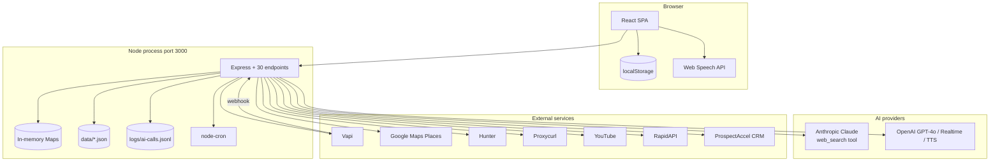

### 39.2 Component diagram

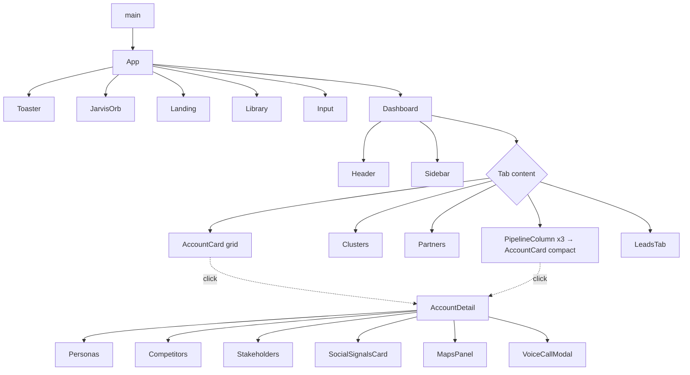

### 39.3 Data flow

See §21.3.

### 39.4 User flow

See §4.1.

### 39.5 Sequence diagrams

See §22.

### 39.6 ER diagram

See §13.2.

### 39.7 Deployment diagram

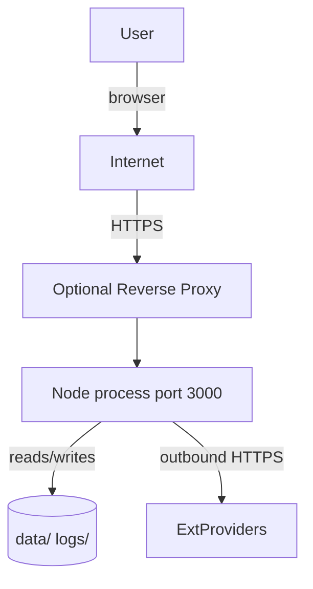

Currently no reverse proxy in the repo — that's a deployment-side concern.

### 39.8 API flow

```mermaid
flowchart LR
  Client -->|POST /api/analyze-business| A1
  A1 -->|auto-chain| A2[POST /api/discover-accounts]
  A2 -->|fire-and-forget| A3[/api/enrichment/sweep]
  A2 -->|fire-and-forget| A4[/api/scheduler/enroll]
  Client -->|POST /api/analyze-account?stream=1| A5
  Client -->|POST /api/cluster-accounts| A6
  Client -->|POST /api/analyze-social| A7
  Client -->|POST /api/crm/sync| A8
  Client -->|POST /api/voice-call/session| A9
```

### 39.9 Authentication flow

```mermaid
flowchart TB
  User -->|no auth| App[SPA]
  App -->|no auth| API[Same-origin API]
  API -->|JWT| CRM[ProspectAccel]
  Vapi -->|HMAC signed| API
```

---

## 40. End-to-End Walkthrough

**Business scenario:** A founder of a Series-B fintech infrastructure company wants to build an outbound engine in 30 minutes.

### Step 1 — Landing
- Visits <http://localhost:3000>
- `App.tsx:440` renders `LandingPage` because `showLanding=true`, `analysis=null`.
- Reads hero, watches product video (`public/intro-video.mp4`), clicks **Enter workspace**.
- `dismissLanding()` sets `showLanding=false`.

### Step 2 — Analyze Website
- App now renders `BusinessInput` (`App.tsx:549`).
- Founder pastes `https://openfuse.dev` and picks 15 accounts.
- Click submits → `analyzeBusiness(url, 15)` at `App.tsx:216`.
- Server hits `/api/analyze-business` (`server.ts:1447`).
- Fetches page HTML (root URL, so page-fetch skipped — analyzed via prompt with URL).
- Model: Haiku 4.5 → returns `BusinessAnalysis`.
- Client persists to `localStorage.gtm_analysis`.

### Step 3 — Auto-chain discovery
- App fires `discoverAccounts(analysis, 15)` at `App.tsx:248`.
- Server hits `/api/discover-accounts` (`server.ts:1671`).
- Anthropic Opus 4.7 with web search runs — searches "European fintech Series B-D PSD2 open banking" etc.
- Returns 15 `TargetAccount` records.
- Client assigns ids + `status: 'new'`, sets state.

### Step 4 — Auto-sweep leads
- `App.tsx:301` fires POST `/api/enrichment/sweep` with top 3 accounts.
- Server calls Hunter (or stub) → learns email patterns → creates `LeadRow`s in `data/leads.json`.
- `App.tsx:313` fires POST `/api/scheduler/enroll` with all 15 accounts → written to enrollment queue for future cron sweeps.
- Toast: "Auto-discovered 8 leads across 3 accounts. Open the Leads tab."

### Step 5 — Dashboard renders
- App switches from `BusinessInput` to `Dashboard`.
- Recommendations tab shows 15 cards sorted by `priorityIndex` (calibration).
- Cards are colored by priority tier via `getTierTheme` in `AccountCard.tsx:41`.

### Step 6 — Click into top account
- Founder clicks card #1.
- `onAnalyzeAccount(id)` → `App.analyzeAccountDetail(id)` (`App.tsx:326`).
- Streams to `/api/analyze-account?stream=1`.
- Server fans out 3 sub-calls (personas, competitors, stakeholders) — each streams `search` events.
- Client UI shows "Searching for: recent CFO announcements at OpenFuse..." live.
- After ~25s, `result` event fires → `AccountDetail` renders full analysis.

### Step 7 — Push to CRM
- Founder clicks **Push to CRM**.
- Client `findMatch()` in `crmMirror.ts:119` → no existing record.
- POST `/api/crm/sync` → ProspectAccel (or mirror).
- Account updated with `crmSyncedAt` + `crmRecordId`.
- Auto-save fires (`App.tsx:135`) → updates saved report.

### Step 8 — Book AI voice call
- Founder picks **Place AI voice call** on account card.
- Modal opens (`VoiceCallModal.tsx`), founder picks `discovery` script + phone mode + E.164 number.
- POST `/api/voice-call/start` → Vapi dials.
- Vapi delivers transcript events via `POST /api/vapi/webhook` (HMAC verified).
- Server updates in-memory call state; client polls `GET /api/voice-call/:callId`.
- Founder sees transcript stream + final outcome.

### Step 9 — Save report
- Founder clicks **Save Report**, types "OpenFuse - EU Fintech Q3".
- `handleSaveReport` (`App.tsx:144`) writes to `localStorage.gtm_saved_reports`.
- Header badge count increments.

### Step 10 — Next-day
- Cron fires `runPersonaDiscoveryJob` (04:00 local).
- Sweeps enrolled 15 accounts via Hunter → 12 new `LeadRow`s appear.
- Founder opens Leads tab next morning → sees new personas ready to email.

**Files touched in this walkthrough:**

- `src/App.tsx`, `src/main.tsx`, `src/components/LandingPage.tsx`
- `src/components/BusinessInput.tsx`, `src/components/Dashboard.tsx`, `src/components/AccountCard.tsx`, `src/components/AccountDetail.tsx`
- `src/components/VoiceCallModal.tsx`, `src/components/SavedReportsLibrary.tsx`
- `server.ts` (analyze-business, discover-accounts, enrichment/sweep, scheduler/enroll, analyze-account, crm/sync, voice-call/start, voice-call/webhook, scheduler cron)
- `src/db/leads.ts` (upsertLead x multiple), `src/utils/emailPattern.ts`, `src/utils/crmMirror.ts`, `src/utils/calibration.ts`, `src/utils/geography.ts`
- `src/services/proxycurl.ts` (if lead health job runs)
- `logs/ai-calls.jsonl` (append on every AI call), `data/leads.json`, `data/scheduler-state.json`

---

## 41. Production Readiness Assessment

| Dimension | Score | Notes |
|---|---|---|
| **Architecture quality** | 7 / 10 | Single-process pattern is elegant for the scope but limits scale. Clear provider abstraction. |
| **Code organization** | 6 / 10 | `utils/`, `db/`, `services/` well-organized. But 3 mega-files (Dashboard 5.4k, AccountDetail 2.6k, LandingPage 2.1k) hurt navigation. |
| **Scalability** | 4 / 10 | In-process AI cache + JSON DB + no horizontal scaling. Fine for demo, not for production traffic. |
| **Security** | 5 / 10 | JWT + HMAC + SSRF hardening present. No auth on end-user APIs; no rate limiting on most endpoints; no CORS enforcement in code. |
| **Maintainability** | 6 / 10 | Clear conventions in CLAUDE.md; consistent patterns per endpoint; good type coverage. Missing tests hurt. |
| **Performance** | 7 / 10 | Prompt caching, model tiering, streaming, in-process caches, debouncing all deployed. AI-call latency dominates. |
| **Documentation quality** | 5 / 10 | CLAUDE.md is excellent for AI onboarding. Human onboarding docs sparse (this file fills that gap). |
| **Testing quality** | 1 / 10 | No test suite. `tsc --noEmit` is the only guardrail. |
| **Technical debt** | 5 / 10 | Managed but present: mega-files, no ErrorBoundary, no CI, no `.env.example`. |
| **Observability** | 6 / 10 | JSONL AI logging + eval runner is above hackathon norm. No structured logger for general server events. |
| **Deployment maturity** | 3 / 10 | No Docker, no CI, no orchestration. Manual `npm run build && node dist/server.cjs`. |

**Overall score: ~55 / 100 — Solid hackathon prototype with clear seams for production hardening.**

### Strengths

1. **AI provider abstraction** — swappable at env-level with graceful fallback.
2. **Observability by design** — every AI call logged with token counts + cache hits.
3. **Prompt engineering** — few-shot examples, enum discipline, cached system prompt.
4. **SSRF hardening** for outbound page fetches.
5. **Streaming UX** for long AI calls.
6. **Progressive enhancement** — every external integration has a stub / fallback so the app runs without any key configured.
7. **Voice-first UX** with Jarvis — genuinely novel.
8. **Persistence discipline** — every user-relevant state auto-persisted; useEffect + localStorage pattern applied consistently.

### Weaknesses

1. **No tests.**
2. **No auth** — anyone hitting the server can burn AI credits.
3. **JSON DB** — Windows-era hackathon choice; hurts beyond ~10k leads.
4. **Mega-components** — three files >2k lines.
5. **No CI/CD, no Docker.**
6. **No structured logger.**
7. **No ErrorBoundary.**
8. **PII in logs** — no redaction of user URLs / AI outputs.

### Improvement roadmap (high-impact, low-effort first)

1. **Add `.env.example`** — 30 min.
2. **Add ErrorBoundary + Sentry** — 2 hrs.
3. **Add auth (magic link + JWT session)** — 1 day.
4. **Add rate limiting middleware** (`express-rate-limit`) — 1 hr.
5. **Add health endpoint** `GET /healthz` — 15 min.
6. **Migrate `data/leads.json` → Supabase or Postgres** — 1-2 days (swap `src/db/leads.ts` internals only).
7. **Split Dashboard.tsx** by tab into 5 files — 4 hrs.
8. **Add Playwright E2E** for the happy-path — 4 hrs.
9. **Dockerize** — 2 hrs.
10. **CI workflow** (GitHub Actions: install → lint → build) — 1 hr.
11. **Add per-endpoint token budget alerts** in `evals/inspect.ts` — 2 hrs.
12. **Add PII redaction on prompt logging** — 2 hrs.

---

## 42. If You Read This Entire Document

You now confidently understand:

- ✔ **Complete architecture:** single-process Node/Express host serving both React SPA and 30 JSON APIs, with an AI-provider abstraction (Anthropic primary, OpenAI fallback) that runs every AI call through a single funnel with structured tool-use output, retries, model tiering, prompt caching, and JSONL observability. Persistence is `data/*.json` server-side and `localStorage` client-side. Cron scheduler is off by default but ships three ready-to-arm jobs (lead health, pattern refresh, persona discovery).
- ✔ **User workflows:** landing → analyze URL → auto-chained discovery → click card → streaming deep dive → optional CRM push / voice call / social signals / lead sweep; alternative paths through Saved Reports library and Jarvis voice commands.
- ✔ **Data flow:** where data originates (AI or user), how it moves (fetch → endpoint → external API → response → setState → localStorage), where it's cached (in-process Maps + Anthropic ephemeral prompt cache + browser localStorage), and how it degrades (hand-authored fallbacks on every AI failure).
- ✔ **APIs:** 30 endpoints, all documented in the index with request shape + files + auth. The `generateStructuredData` helper is the single seam.
- ✔ **Modules:** 13 top-level feature modules from Business Analysis to Jarvis, each mapped to files, endpoints, dependencies, and data flow.
- ✔ **Authentication:** none for end user; JWT for CRM (server-to-server); HMAC for Vapi webhook; SSRF guard for outbound fetches.
- ✔ **Database:** hackathon JSON store with three collections (companies, leads, events), dedup by `linkedin_url`, event-sourced lifecycle; ready to migrate to Postgres by touching only `src/db/leads.ts`.
- ✔ **Configuration:** 25+ env variables tabulated with purpose + defaults + impact; six config files at repo root all explained.
- ✔ **Deployment:** `npm run build` → `dist/server.cjs` + `dist/` SPA; `NODE_ENV=production node dist/server.cjs`. No Docker or CI shipped.
- ✔ **Third-party integrations:** 10 external services with fallback strategy, env variable, cost profile, and SDK per integration.
- ✔ **Business logic:** 15 hidden rules enumerated — count clamps, priority tiering, freshness decay, sector multipliers, lead status transitions, email pattern confidence, cron thresholds, rate limits, Jarvis reply length.
- ✔ **Folder structure:** every folder's raison d'être documented; conventions (utils = pure, services = SDK adapters, db = DB seam) explained.
- ✔ **Request lifecycle:** 12-step trace from user click to UI update, with cache/AI/fallback branches shown in Mermaid.
- ✔ **Extension points:** how to add an AI endpoint, a Dashboard tab, a Jarvis action, a leads field.
- ✔ **Production setup:** rated ~55/100 with an actionable 12-item improvement roadmap.
- ✔ **Common debugging locations:** `logs/ai-calls.jsonl`, `GET /api/scheduler/status`, `GET /api/voice-call/:callId`, `GET /api/crm/status`, DevTools localStorage inspector.
- ✔ **Overall execution flow:** a real end-to-end walkthrough from URL paste to next-day cron enrichment, listing every file touched.

You can confidently say:

> *"I now understand every important corner of this project — its purpose, its architecture, its data model, its APIs, its integrations, its scoring logic, its failure modes, and its production readiness. I can start contributing immediately without reverse engineering the code."*

---

*End of document.*
